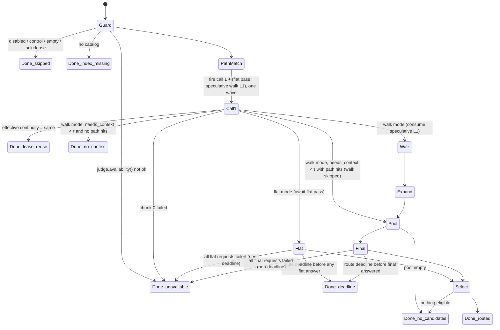

# 09 · Router: the per-prompt pipeline

**Status:** draft for review
**Spec sections:** §11 (all), §8.5 (expansion use), §11.9 (budgets), §12.4 (lease interplay), §14.3 (low confidence), §17.4 (attribution), §18.1 (decision record)
**Depends on:** 00-foundations, 04-graph-edges (`graph/expand.py`), 05-catalog-store (tree/edge lookups), 07-judge, 08-path-matching, 10-lease, 11-note, 13-config, 14-security-privacy (redaction), 15-observability
**Code:** `surf/route/pipeline.py`, `skip.py`, `call1.py`, `flat.py` (new: flat pass), `walk.py`, `final.py`, `select.py`, `surf/route/state.py` (new: judge-state construction and truncation), `surf/route/trace.py` (new: `RouteTrace`), `surf/route/wordings.py` (new: shipped wording constants)

---

## 1. Purpose and scope

Given a prompt, produce a `RouteResult` (00 §3): a small selection of content surfaces and capability decisions, a note (via 11), a lease update (via 10), a decision record (via 15) and, on request, a full trace. It is the only component that sequences judge calls.

**In scope:** pipeline state machine, deadlines, skip rules, mode choice (flat or walk), request construction, call 1, flat pass, speculative requests, walk, expansion invocation, pool assembly, final pass, selection, status and low-confidence determination, `RouteTrace`.
**Out of scope:** path extraction (08), expansion scoring math (04), lease storage and union rules (10), note text (11), wording and threshold values (tuned in 16).

---

## 2. Interfaces

```python
# route/pipeline.py
@dataclass(frozen=True)
class RouterContext:
    catalog: CatalogReader          # 05 read API over .surf/cache/index.sqlite (D-05-5); never JSONL
    path_index: PathIndex           # 08
    judge: Judge                    # 07
    thresholds: Thresholds; calibrated: bool      # 07 §4.9
    leases: LeaseManager | None     # 10; None when no session id
    cfg: RouterConfig               # 13
    redactor: Redactor              # 14
    decisions: DecisionLogger       # 15
    clock: Clock

OnRouteDone = Callable[[RouteRequest, RouteResult, RouteTrace], None]

async def route_async(req: RouteRequest, ctx: RouterContext, *, explain: bool = False,
                      enabled: bool = True, on_route_done: OnRouteDone | None = None
                      ) -> RouteResult: ...    # never raises
def route(req: RouteRequest, ctx: RouterContext, *, explain: bool = False,
          enabled: bool = True, on_route_done: OnRouteDone | None = None
          ) -> RouteResult: ...                # asyncio.run wrapper

# route/skip.py
def check_skip(prompt: str, *, lease_exists: bool, enabled: bool, cfg: RouterConfig) -> SkipReason | None

# route/state.py
def judge_state(step: Step, *, request: str, project: str, lease: Lease | None,
                last_message: str | None, location: str | None, cfg: RouterConfig) -> dict[str, str]
def truncate_head_tail(text: str, max_tokens: int) -> str

# route/call1.py
def build_call1(state: dict[str, str], *, lease_exists: bool, caps: list[Card],
                limits: RequestLimits) -> list[JudgeRequest]
def interpret_call1(outcomes: list[JudgeResponse | JudgeError], ...) -> Call1Outcome

# route/flat.py
def choose_mode(catalog: CatalogReader, cfg: RouterConfig) -> Literal["flat", "walk"]   # §4.5
def build_flat(cards: list[Card], path_ids: list[SurfaceId], state: dict[str, str],
               limits: RequestLimits, cfg: RouterConfig) -> list[JudgeRequest]           # §4.8
def interpret_flat(outcomes: list[JudgeResponse | JudgeError], ...) -> FinalOutcome

# route/walk.py
class Walker:
    def start_level(self, frontier: list[FrontierNode], depth: int) -> LevelRun   # fires ask_many as a task
    async def run(self, first: LevelRun | None, needs_context: float, *,
                  excluded: frozenset[SurfaceId], has_path_hits: bool) -> WalkResult

# route/final.py
def build_final(pool: list[PoolEntry], state: dict[str, str], cfg: RouterConfig) -> list[JudgeRequest]
async def run_final(...) -> FinalOutcome

# route/select.py
class SelectParams(BaseModel):      # everything applied after the final pass
    final: float; path_hit_floor: float; cap_use: float; cap_skip: float; needs_context: float
    max_pointers: int; max_caps_use: int; max_caps_skip: int
    collapse_min_files: int; collapse_max_dir_files: int

def select(trace: RouteTrace, params: SelectParams) -> SelectionOutcome     # pure; no catalog, no judge, no clock
```

Callers: `cli.py` (`surf route`), `adapters/claude_code.py`, `adapters/mcp_server.py` (awaits `route_async`), `eval/runner.py` (with `explain=True`).

`on_route_done(req, result, trace)` is called exactly once per route, **after** the result is final and with the trace **even when `explain=False`** (15 §2 builds the decision record from it). Only `RouteResult.trace` is gated by `explain`. Exceptions raised by the callback are caught and warned once; they never change the result. The Claude Code adapter emits and flushes its stdout payload before its callback appends to the log (15).

---

## 3. Data structures

### 3.1 Internal records

```python
class Step(StrEnum): CALL1 = "call1"; WALK = "walk"; FINAL = "final"

class Continuity(StrEnum): SAME = "same"; EXTENDS = "extends"; NEW = "new"

class Call1Outcome(BaseModel):
    ok: bool                                  # chunk 0 answered
    continuity_raw: ChoiceA | None
    continuity: Continuity                    # effective, after §4.6 overrides
    override: Literal["no_lease", "low_conf", "stale", "path_hits_outside_lease"] | None
    needs_context: float | None
    caps: dict[SurfaceId, float]              # missing caps absent
    failed_chunks: list[int]

class WalkCandidate(BaseModel):
    id: SurfaceId; score: float
    via: Literal["judged", "flattened", "dir_admit", "guard", "deadline_admit", "dir_hit_flatten"]

class Tier(IntEnum): PATH_HIT = 1; WALK = 2; AMBIGUOUS_PATH = 3; EXPANSION = 4   # flat mode: hits tier 1, all else tier 2

class PoolEntry(BaseModel):
    id: SurfaceId; tier: Tier; pre_score: float
    source: str | None                        # anchor id + edge kind for expansion
    path_hit: PathHit | None
    rank: int; truncated: bool
    excluded: Literal["lease"] | None         # extends: already in the lease

class FinalOutcome(BaseModel):
    scores: dict[SurfaceId, float]; unjudged: list[SurfaceId]; requests: int; error: ErrorKind | None

class LowConfidence(StrEnum):
    DEAD_END_GUARD = "dead_end_guard"; WALK_DEADLINE = "walk_deadline"
    FINAL_PARTIAL = "final_partial"          # also: a flat-pass request failed
    UNCALIBRATED = "uncalibrated_thresholds"
```

### 3.2 Judge state keys

| State key | Call 1 | Flat | Walk | Final | Source / limit |
|---|---|---|---|---|---|
| `request` | ✓ | ✓ | ✓ | ✓ | redacted prompt, head+tail ≤ `router.request_max_tokens` (1,500) |
| `project` | ✓ | ✓ | ✓ | ✓ | `project.descriptor` from config, else the auto-derived descriptor stored in `meta.json` (02 §4.10), ≤ 200 chars |
| `previous_task` | ✓ if lease | – | – | – | lease `task_request`, redacted, ≤ `router.context_max_tokens` (300) |
| `last_message` | ✓ if given | – | – | – | `RouteRequest.previous_message`, redacted, ≤ 300 tokens |
| `location` | – | – | ✓ | – | breadcrumb `root › src › services`; schema root renders as `root › database schema` |

State stays small on purpose (≤ ~2k tokens): Jev's accuracy falls with irrelevant **state**, while candidates are questions judged independently against it (`docs/jev-reference.md` §9–10; spec principle 5). Content requests (flat, walk, final) never carry call 1's continuity keys (spec D16).

Keys are omitted (not empty) when absent. Key order is fixed as listed (fixture keys are order-independent anyway, 07 §4.10).

**Truncation (`truncate_head_tail`).** Token estimate = `ceil(chars / 4)` (same heuristic as 07). If over budget: keep the first 60 % and last 40 % of `max_tokens × 4` chars, cut each at the nearest whitespace within 50 chars, and join with `\n[… N characters omitted …]\n`. Applied after redaction. Deterministic.

### 3.3 Question keys and wordings

| Step | Key | Type | Wording key (`router.wording.*`) |
|---|---|---|---|
| call 1 | `continuity` | Choice `same`/`extends`/`new` | `continuity` (+ option descriptions) |
| call 1 | `needs_context` | Noul | `needs_context` |
| call 1 | `cap:<id>` | Noul | `capability` |
| flat | `f:<id>` | Noul | `final` |
| walk | `w:<id>` | Noul | `walk` |
| final | `f:<id>` | Noul | `final` |

The shipped wordings are constants in `route/wordings.py` and **must equal the `shipped` entries of `bench/wordings.yaml`** (16 §3.6; a unit test enforces it). Initial values are the spec §11.4/§11.5/§11.7 texts; continuity is stored as `instructions` + `options` (same/extends/new descriptions). `router.wording.*` config overrides exist for experiments; eval's `--wording key=id` sets them. `{card}` is replaced by the card's stored `card` string. The judge maps keys to opaque wire keys (07 §3.1).

### 3.4 `RouteTrace` (`route/trace.py`)

Built on every route (cheap) and passed to `on_route_done`; attached to `RouteResult.trace` only when `explain=True`. It satisfies the field contract in 15-observability §3.3 (consumers: decision record, `--explain`, eval attribution 16 §4.6, offline re-selection 16 §4.8). Field names below are the contract names.

```python
class WalkNode(BaseModel):                  # one per judged child (plus the root)
    id: SurfaceId; parent: SurfaceId | None; depth: int
    p: float | None                         # None = unjudged (chunk failed / missing key)
    cum: float                              # parent cum × p
    action: Literal["expand", "flatten", "candidate", "pruned", "guard",
                    "skipped_path_hit", "beam_cut", "dir_admit", "deadline_admit", "unjudged"]
    chunk_no: int

class WalkTraceT(BaseModel):
    nodes: list[WalkNode]
    levels: int; requests: int
    dead_end_guard: bool; deadline_hit: bool; depth_cap_hit: bool
    speculative: Literal["used", "discarded", "off", "n/a"]
    frontier_cut: list[SurfaceId]           # dropped by max_frontier
    latency_ms: int

class FlatTraceT(BaseModel):
    est_tokens: int                         # flat-pass estimate used for the mode choice (§4.5)
    requests: int
    speculative: Literal["used", "discarded", "off"]
    latency_ms: int

class Call1Trace(BaseModel):
    needs_context: float | None
    continuity: ChoiceA | None              # raw
    continuity_effective: Continuity
    override: Literal["no_lease", "low_conf", "stale", "path_hits_outside_lease"] | None
    caps: dict[SurfaceId, float]
    failed_chunks: list[int]; latency_ms: int

class PathHitT(BaseModel):
    id: SurfaceId; strength: float; raw_token_index: int      # index into the prompt's token list, never the token

class ExpansionT(BaseModel):
    id: SurfaceId; score: float; via_kind: EdgeKind; via_anchor: SurfaceId; admitted: bool

class PoolItem(BaseModel):                  # pre-truncation, rank order; also everything select() needs
    id: SurfaceId; type: SurfaceType
    source: Literal["path_hit", "walk", "flatten", "expansion", "flat", "ambiguous_path", "dir_hit"]
    rank: int; pre_score: float
    path_hit_rank: int | None               # 08 order, None if not a hit
    parent: SurfaceId | None                # for collapse / redundancy
    parent_direct_files: int | None         # number of direct files in `parent` (collapse rule)
    ancestors: list[SurfaceId]              # for the dir/descendant redundancy rule

class RouteTrace(BaseModel):
    route_id: str; status: RouteStatus
    mode: Literal["flat", "walk"]
    flat: FlatTraceT | None
    low_confidence: list[LowConfidence]
    skip_reason: SkipReason | None
    call1: Call1Trace | None
    path_hits: list[PathHitT]
    path_candidates: list[SurfaceId]        # ambiguous (08)
    walk: WalkTraceT | None
    expansion: list[ExpansionT]             # admitted + top 20 rejected (score < threshold)
    pool: list[PoolItem]                    # before truncation
    pool_cut: list[SurfaceId]               # removed by max_candidates
    excluded_by_lease: list[SurfaceId]      # extends only
    final: dict[SurfaceId, float]; final_unjudged: list[SurfaceId]; final_latency_ms: int | None   # flat mode: the flat-pass answers
    above_threshold: list[SurfaceId]        # priority order
    budget_cut: list[SurfaceId]
    collapsed: dict[SurfaceId, list[SurfaceId]]
    redundant_dirs: list[SurfaceId]; diversity_swaps: list[tuple[SurfaceId, SurfaceId]]
    selected: Selection
    lease: LeaseInfo; delta: list[SurfaceId] # 15 §3.1 LeaseInfo; additions on extends
    judge: JudgeUsageSummary                # 07 §3.3
    judge_requests: list[dict] | None       # only with --show-requests / eval record mode
    thresholds_profile: str; calibrated: bool
    latency_ms: LatencyMs                   # {total, call1, walk, expand, final, overhead, process} (15 §3.1)
    explain: ExplainExtras | None           # explain only: raw path mentions (08 trace), card texts
```

Raw prompt text never enters the trace outside `explain` (raw path mentions in `ExplainExtras`), so the decision record can be built from it safely.

**Offline re-selection.** `select(trace, params)` reads only `trace.pool`, `trace.final`, `trace.final_unjudged`, `trace.call1` and `trace.path_hits`, so eval can sweep `final`, `path_hit_floor`, `max_pointers`, `cap_use`, `cap_skip` and the collapse parameters on stored traces without judge calls (16 §4.8). Raising `needs_context` offline is emulated by treating rows with `call1.needs_context < τ` and no path hits as `no-context`; lowering it isn't exact (the walk never ran) and 16 must not sweep downward offline. Flat-mode traces hold every leaf's strict answer, so `final` sweeps on them are exact and the gate can be swept both ways.

**Attribution.** 16 §4.6 owns the bucket rules (status, lease, gate, budget, final, truncation, walk sub-reasons). The trace provides every input: `budget_cut`, `final`, `pool_cut`, `walk.nodes[*].action`, `walk.depth_cap_hit`, `walk.deadline_hit` and rejected expansions.

---

## 4. Behavior / algorithm

### 4.1 State machine



| Terminal | Status | Note | Lease |
|---|---|---|---|
| skipped | `skipped` | none | untouched |
| index missing | `index-missing` | none | untouched |
| unavailable | `judge-unavailable` | none | untouched |
| lease reuse | `lease-reuse` | none | `touch()` |
| no context | `no-context` | capability lines only (none if no caps decided) | `commit(continuity, content=[], caps)` |
| no candidates | `no-candidates` | capability lines only | `commit(continuity, content=[], caps)` |
| deadline | `deadline` | capability lines only | **untouched** (D-09-17) |
| routed | `routed` | full or delta note | `commit(continuity, content, caps)` |
| any exception | `error` | none | untouched |

`router.mode` forces a mode for ablations (16 §3.5): `flat` (A0) runs the flat pass whatever its size; `walk` (A1–A3, A4w) walks every repo; `auto` (default) chooses by budget (§4.5).

Every terminal writes one decision record. The whole body of `route_async` is inside the fail-open guard (00 §5); per-stage guards also wrap path matching and expansion so a bug there degrades that stage (empty result) instead of the route.

### 4.2 Deadlines (two budgets)

- `route_deadline = Deadline(router.route_deadline_ms = 3000)`, started at `route_async` entry (adapter process start-up is outside it; 12 reports it separately).
- `walk_deadline = route_deadline.sub(router.walk_deadline_ms = 2000)`, measured **from the same start**, because walk level 1 starts at t≈0 speculatively. This leaves ≥ 1,000 ms for expansion and the final pass.
- Call 1, the flat pass and the final pass use `route_deadline`; walk levels use `walk_deadline`. Each judge request's timeout is `min(judge.timeout_ms, deadline.remaining_ms())` (07 §4.5).
- A new walk level starts only if `walk_deadline.remaining_ms() ≥ router.min_level_ms` (400). The final pass starts only if `route_deadline.remaining_ms() ≥ router.min_final_ms` (300); otherwise status `deadline`.

### 4.3 Step 0: guard and skip rules (`skip.py`)

Order:
1. `enabled` false (session or project off) → `skipped/disabled`.
2. Prompt empty or whitespace → `skipped/empty`.
3. Control command `^\s*surf\s+(on|off|status|reroute|stats)\b` → `skipped/control` (the adapter acts on it).
4. Ack: lowercase; strip punctuation and emoji; split on whitespace; if `1 ≤ tokens ≤ router.skip.ack_max_words` (4), every token is in `router.skip.ack_words`, **and** a lease exists → `skipped/ack`. Default words: `ok okay k kk thanks thank you thx ty yes y yep yeah sure lgtm continue go ahead proceed next please do it great cool nice perfect`. "ok, fix it" is not an ack (`fix`), and neither is anything without a lease.
5. Catalog missing or unreadable → `index-missing`.
6. `judge.availability()` not ok (no key, breaker open, null) → `judge-unavailable` (reason recorded).

### 4.4 Step 1: path matching and post-processing

`pm = match_paths(raw_prompt, ctx.path_index, cfg.pathmatch)` (08). Then:
1. **Migration aliasing.** Any `code:` id with an `alias` edge to a `mig:` id is replaced by the `mig:` id (F3). The `code:` twin is still excluded from the walk.
2. **Walk exclusions** = the ids of **file** hits (and their `code:` twins). Directory hits and ancestors are not excluded: excluding `src/` because `src/x.ts` was hit would blind the walk to the rest of `src/` (D-09-4).
3. **Directory hits.** A dir hit enters the pool at tier 1 as the dir itself. If its `files_total ≤ flatten_at`, its files also become walk-tier candidates with score `flatten_factor × strength` (`via="dir_hit_flatten"`).
4. **Out-of-lease hits** (used in §4.6): hits whose path is neither in the lease's content nor under a leased directory (compared by path, F2).

### 4.5 Mode and step 2: call 1 (`flat.py`, `call1.py`)

**Mode** (decided before any judge call, so the content requests can go out with call 1):

```
flat_set   = catalog.flat_cards()          # 05: code_file, doc_file, db_table minus external stubs; not dirs, db:*, mig:
est_tokens = catalog.flat_card_tokens()    # 05: Σ approx_tokens(card) over flat_set, stored at index time
             + len(flat_set) × FLAT_QUESTION_OVERHEAD (25: wording + JSON)
             + n_requests × (approx_tokens(state) + REQUEST_OVERHEAD (300))
mode = "flat" if est_tokens ≤ router.flat_max_tokens else "walk"      # router.mode = auto
```

The budget is in tokens because the binding limit is the account-wide token rate (250k tokens/s for `jev-1.13`, shared by every session and eval run), not request count or price. 40,000 tokens ≈ 450 file cards ≈ $0.0017 and ≤ 16 % of one second's account budget (spec D14, `docs/architecture-review.md` §3.1).

**Call 1 questions**, in order: `continuity` (if a lease exists), `needs_context` (always; it gates only in walk mode, and is recorded in flat mode for gate evaluation, Q-09-14), `cap:<id>` for every capability card (sorted by id). Content is never asked in call 1 (spec D16).

**Chunking.** Split only when the backend's per-request limits (07 §4.2, `RequestLimits`) are exceeded, into token-balanced chunks. `continuity` and `needs_context` are in chunk 0 only. Every chunk carries the full call-1 state (§3.2), so capability judgments on "ok, now fix it" still see the previous task. All chunks go out in one `ask_many`, in the same wave as the flat pass or the speculative walk level 1 (§4.7).

**Interpretation.**
- Chunk 0 failed → `judge-unavailable`, discard speculation.
- Another chunk failed → its caps are missing (unmentioned).

### 4.6 Decision after call 1

Evaluated in order; `τ` = thresholds:

1. **Effective continuity.** No lease → `new` (`override="no_lease"`). Else raw choice, then: `same` with `confidence < τ.continuity_min_conf` → `extends` (`low_conf`); `same` with a stale lease → `extends` (`stale`); `same` with ≥ 1 out-of-lease path hit → `extends` (`path_hits_outside_lease`, D-09-5: a stack trace pasted mid-task must be routed).
2. `same` → discard speculation; `lease-reuse`.
3. Flat mode → await the flat pass (§4.8); selection reads its answers. No gate, walk, expansion or final pass: "nothing ≥ τ.final" is the gate (`no-candidates`).
4. Walk mode, `needs_context < τ.needs_context` and no path hits (tier-1 hits; ambiguous candidates don't count) → discard speculation; `no-context`.
5. Walk mode, `needs_context < τ.needs_context` with path hits → discard speculation; skip the walk; pool = hits + ambiguous candidates + expansion (D-09-6).
6. Walk mode → §4.9 with the speculative level 1.

Capability decisions (all non-`same` outcomes): `use` = `p ≥ τ.cap_use`, sorted by p desc, first `router.max_caps_use` (6); `not_needed` = `p ≤ τ.cap_skip`, sorted by p asc, first `router.max_caps_skip` (10). Everything else unmentioned.

### 4.7 Speculative content requests

- With `router.speculative` true, the content requests go out right after path matching, in the same wave as call 1, as an `asyncio.Task`: the **flat pass** in flat mode, **walk level 1** (`walker.start_level([ROOT], depth=0)`) in walk mode. Their state never depends on call 1 (§3.2), so they are valid before continuity is known. Without a lease, call 1 can't say `same`, so the requests are never wasted.
- They stay separate requests, never merged into call 1: call 1's state carries `previous_task`, which is irrelevant state for content judgments on a new task (spec D16).
- In walk mode, **selection** for level 1 (threshold, beam, dead-end guard) runs only after call 1 returns, because the guard reads `needs_context` (D-09-3).
- Discard paths (§4.6 rows 2, 4, 5 and call 1 failure) call `task.cancel()`; the ledger records the requests as cancelled with estimated tokens (07 §4.4). Trace `speculative="discarded"`. A discarded flat pass costs at most `flat_max_tokens` (~$0.0017).
- Speculation off → the content requests start after call 1, same code path.

### 4.8 Step 3a: flat pass (`flat.py`)

- **Questions:** one `f:<id>` Noul with the **final** wording for every card in `flat_set`, plus every path-hit id not already in it (directory hits, `mig:` hits after aliasing, §4.4), ordered by churn rank desc then id. Ambiguous path candidates are already in `flat_set`.
- **State:** `{request, project}`, the final-pass state.
- **Requests:** token-balanced chunks within `RequestLimits` (07 §4.2; `jev`: ≤ 30k estimated tokens), all in one `ask_many`, each repeating the state.
- **Result:** `trace.final` = the answers; `trace.pool` = every flat question (path hits tier 1 in 08 order, the rest tier 2 by p desc), with no `max_candidates` truncation (everything was judged). On `extends`, leased ids are dropped after the answers arrive (D-09-15).
- **Failures:** a failed request → its ids `unjudged`, `FINAL_PARTIAL`. All failed: after the route deadline → `deadline`; otherwise `judge-unavailable`.
- Then selection (§4.13). Walk, expansion and the final pass don't run: every leaf already has a strict judgment, so expansion could only re-ask questions already answered.

### 4.9 Step 3b: the walk (`walk.py`, walk mode)

```python
async def run(first, needs_context, *, excluded, has_path_hits):
    frontier = [FrontierNode(ROOT, p_cum=1.0)]
    cands: dict[SurfaceId, WalkCandidate] = {}
    for depth in range(cfg.max_depth):
        if not frontier: break
        if depth > 0 and walk_deadline.remaining_ms() < cfg.min_level_ms:
            admit(frontier, via="deadline_admit"); deadline_hit = True; break          # step 7
        run = first if depth == 0 and first else start_level(frontier, depth)        # step 1
        outcomes = await run.results()                                               # per chunk
        per_node = aggregate(outcomes)                                               # step 2
        chosen = {}
        for node, kids in per_node.items():                                          # step 3
            ranked = sorted((k for k in kids if k.p is not None), key=lambda k: (-k.p, k.id))
            chosen[node] = [k for k in ranked if k.p >= τ.walk][: cfg.beam_max]
            if node.all_chunks_failed:
                admit([node], via="deadline_admit" if deadline_err else "dir_admit")  # step 7
        if (not any(chosen.values()) and not cands and not has_path_hits
                and needs_context >= τ.walk_guard):                                  # step 5
            best = top cfg.beam_min children of the level by (node.p_cum * k.p, k.id)
            chosen = group(best); guard_fired_at = depth
        next_frontier = []
        last = depth == cfg.max_depth - 1
        for node, ks in chosen.items():                                              # step 4
            for k in ks:
                s = node.p_cum * k.p
                if k.is_leaf:                      # code_file, doc_file, db_table
                    put(cands, k.id, s, "judged" / "guard")
                elif k.files_total <= cfg.flatten_at:
                    for f in leaves(k.id):     # catalog.subtree_files(dir); catalog.children('db:*') for the schema root
                        if f.id not in excluded: put(cands, f.id, s * cfg.flatten_factor, "flattened")
                elif last:
                    put(cands, k.id, s, "dir_admit")             # step 6
                else:
                    next_frontier.append(FrontierNode(k.id, s))
        frontier = cap_frontier(next_frontier, cfg.max_frontier)                     # step 8
    return WalkResult(cands, ...)
```

1. **Level construction.** For each frontier node: children from `catalog.children(node)` (05; containment lives in the cache, not in `edges.jsonl`), minus `excluded`, sorted by churn rank desc (`high` > `med` > `low` > none, the card's `churn` field per 02 §4.7), then id, split into balanced chunks of ≤ `chunk_size`. One `JudgeRequest` per chunk with state `{request, project, location}` and one `w:<child>` Noul each. All chunks of the level go out in one `ask_many`.
2. **Aggregate per node.** Answers from all chunks of the same node are merged before selection. (The spec pseudocode applies the beam per chunk, which would let a 120-child node expand 18 children; D-09-7.)
3. **Threshold + beam** per node: `p ≥ τ.walk`, top `beam_max`. Children above threshold but beyond the beam are traced `beam_cut`.
4. **Admission.** Leaves become candidates with cumulative score `p_cum × p`. Small directories (`files_total ≤ flatten_at`) are flattened at `× flatten_factor` (0.9). The schema root flattens to its tables when it has ≤ `flatten_at` tables. `put` keeps the max score per id.
5. **Dead-end guard**, per **level**, not per node (D-09-8): fires only if the whole level chose nothing, no candidates exist yet, there are no path hits, and `needs_context ≥ τ.walk_guard` (0.5). It takes the top `beam_min` children of the level by cumulative score and marks the route `DEAD_END_GUARD`. It fires at most once per route.
6. **Directories at the depth cap.** Chosen directories at the last level that are too big to flatten are admitted **as directory candidates** (`dir_admit`) with their cumulative score. The final pass judges their directory card, and the note may point at a directory (D-09-9).
7. **Deadline / failure.** If the walk deadline stops the walk, or all chunks of a node fail, the unexpanded frontier nodes are admitted as directory candidates with `p_cum` and the route is marked `WALK_DEADLINE` (for deadline) — best-so-far per spec §11.5. `db:*` and `root:` are never admitted as candidates.
8. **Frontier cap.** At most `max_frontier` (12) nodes per level, highest `p_cum` first (ties by id); the rest are traced in `frontier_cut` (bounds the request fan-out at deep levels; D-09-10).

### 4.10 Step 4: graph expansion (walk mode)

```python
anchors = {h.id: h.strength for h in path_hits} | {c.id: c.score for c in walk_cands.values()}
hits, rejected = graph.expand.expand(anchors, ctx.catalog, cfg.expand,       # 04 §4.5; ExpandConfig from
                           exclude=excluded_ids,                           # router.expand.* + thresholds.expand
                           collect_rejected=20)                            # top 20 below-threshold, for the trace
```

- 04 owns everything about scoring: depth 1, `kind_factor`, traversal directions, `router.expand.max_per_anchor` (8, per kind), `max_total` (40), `enabled_kinds` (ablations A1–A4), `code:`→`mig:` canonicalisation. Edges are read through `CatalogReader.edges_from` (symmetric kinds are stored once; 05 returns both directions). Directory anchors contribute only through `contains` to README/index files.
- Tables reach the pool through `schema_ref` (file → table, bounded by 04's `max_per_anchor`). They have `db:` cards, so they are judged in the final pass like anything else.
- Migrations reach the pool via `defined_in` only from table anchors (a table hit, or tables from a flattened schema root). The "migration that added `shipped_at`" line in the note is attached by the note builder from `defined_in` edges of selected tables (11), not by the router (Q-09-7).
- Ambiguous path candidates are not anchors.

### 4.11 Pool assembly and truncation (walk mode)

1. Collect entries: tier 1 path hits (08 order), tier 2 walk candidates (score desc), tier 3 ambiguous path candidates (08 order), tier 4 expansion (expand_score desc). Ties by id.
2. Apply the `code:` → `mig:` alias mapping to every entry (§4.4.1; `edges_from(id, [ALIAS])`).
3. Dedupe by id, keeping the lowest tier (and its score).
4. On `extends`, mark entries already in the lease content `excluded="lease"` and drop them (they can't be additions; D-09-15). They still served as expansion anchors.
5. Drop `root:`, `db:*` and capability ids defensively.
6. Keep the first `max_candidates` (40); the rest stay in the trace with `truncated=True`.
7. Empty pool → `no-candidates`.

### 4.12 Step 5: final pass (`final.py`, walk mode)

- State `{request, project}`; one `f:<id>` Noul per pool entry with the final wording and the entry's card (files, dirs, tables, migrations all have cards).
- **One request** (D-09-12): 40 cards of ≤ 150 tokens fit well within `RequestLimits`; the judge splits only if they're exceeded (07 §4.2). Question count barely moves Jev latency (Q-09-3), so there is no split by type.
- Timeout from `route_deadline`. All requests failed with `DEADLINE`/timeout after the deadline → `deadline`; all failed otherwise → `judge-unavailable`. One of two failed → its ids are `unjudged` and the route is `FINAL_PARTIAL`.

### 4.13 Step 6: selection (`select.py`)

`select(trace, params)` is a pure function (16 §4.8, Q-16-8), identical in both modes. Before calling it the pipeline has written everything it needs into the trace: `pool` items carry `type`, `path_hit_rank`, `parent`, `parent_direct_files` and `ancestors` (looked up from the catalog once, during pool assembly); `final`/`final_unjudged` hold the final-pass (or flat-pass) result; `call1.caps` the capability probabilities. Steps 1–5 below use only those fields; the internal `PoolEntry` (with `tier`) is projected to `PoolItem` for the trace.

1. **Eligibility.** Non-path-hit entries: `p ≥ τ.final`. Path hits: `p ≥ τ.path_hit_floor` (0.2). Unjudged entries (including unjudged path hits) are not eligible (consistent with Q-F7: nothing un-judged reaches the note).
2. **Redundancy.** If a directory and any of its descendants are both eligible, drop the directory (the file is more specific; a dir label is still satisfied by the file).
3. **Directory collapse.** Group eligible `code_file`/`doc_file` entries by parent directory `P`. If a group has ≥ `collapse_min_files` (4) members and `P` has ≤ `collapse_max_dir_files` (8) **direct** files, replace the group with `P` (score = max member p; path-hit if any member was). One pass, no cascading (Q-09-9).
4. **Rank.** Path hits first (in 08 order), then by final p desc, then id.
5. **Budget and diversity.** Take the first `max_pointers` (12). Then for each type group — code (`code_file`, `code_dir`), doc (`doc_file`, `doc_dir`), schema (`db_table`, `db_migration`) — that has an eligible entry but nothing selected: swap its best entry in for the lowest-ranked selected **non-path-hit** entry whose group has ≥ 2 selected entries. If there is no such entry, no swap. Swaps are traced; displaced items are `budget_cut`.
6. **Empty** → `no-candidates` (capability lines only).
7. Output `Selection(content=ranked ids, capabilities_use, capabilities_not_needed)`.

Then `leases.commit(session_id, continuity, request=redacted_prompt, selection, index_head)` returns the full lease selection and the delta (10 owns union order and the 12-pointer cap on `extends`). The note builder (11) gets `(status, continuity, selection, delta, low_confidence)`.

### 4.14 Low confidence

`RouteResult.low_confidence = bool(reasons)` where reasons ⊆ {`DEAD_END_GUARD`, `WALK_DEADLINE`, `FINAL_PARTIAL`, `UNCALIBRATED`}. The note builder adds the spec §14.3 line only when the note has content pointers. Reasons go to the decision record and trace; the lease doesn't store them (a later `same` reuses silently).

### 4.15 Latency plan (new task)

**Flat mode** (index within `flat_max_tokens`):

| t (ms, typical) | Event |
|---|---|
| 0–15 | skip, path matching, catalog open, mode choice |
| 15 | call 1 + flat-pass requests fired together over one HTTP/2 connection (07 §4.4) |
| ~250–500 | answered (cold TLS ~200–300 ms + Jev ~100–300 ms); select, lease, note, decision record (≤ 10 ms) |

One round trip. Jev latency barely grows with question count per the docs; the Phase 0 curve at 100/300 questions per request confirms (07 §8.4).

**Walk mode** (above the budget):

| t (ms, typical) | Event |
|---|---|
| 0–15 | skip, path matching, catalog open, mode choice |
| 15 | call 1 chunks + speculative L1 chunks fired together |
| ~400 | both answered; §4.6 decision; L1 selection |
| ~400 | L2 fired (if any frontier) |
| ~800 | L2 answered; expansion + pool (≤ 10 ms) |
| ~810 | final pass fired |
| ~1,200 | final answered; select, lease, note, decision record (≤ 10 ms) |

Three sequential round trips (spec §11.9: 2–4). The ~400 ms per round trip above is conservative: TypeSafe documents ~100 ms for most queries and its cookbooks measure 90–310 ms, so cold TLS set-up (07 §4.5) and hook start-up (12) are the larger costs. Phase 0 replaces these numbers with measured ones.

---

## 5. Configuration

All keys under `[router]` unless noted; 13-config owns validation. Probability thresholds live **only** in `[router.thresholds.<profile>]` (D-09-2).

| Key | Type | Default | Notes |
|---|---|---|---|
| `flat_max_tokens` | int | 40000 | flat pass instead of the walk when its estimate fits (§4.5; spec D14) |
| `flatten_at` | int | 40 | |
| `flatten_factor` | float | 0.9 | |
| `chunk_size` | int | 40 | walk children per request; ≤ the backend's question cap |
| `beam_max` | int | 6 | per node |
| `beam_min` | int | 1 | dead-end guard width (missing from the spec's config sample) |
| `max_frontier` | int | 12 | new |
| `max_depth` | int | 4 | |
| `max_candidates` | int | 40 | |
| `max_pointers` | int | 12 | |
| `max_caps_use` / `max_caps_skip` | int | 6 / 10 | new |
| `collapse_min_files` / `collapse_max_dir_files` | int | 4 / 8 | |
| `mode` | `auto` \| `flat` \| `walk` | `auto` | forced modes for ablations (16 §3.5: A0 flat; A1–A3, A4w walk) |
| `expand.*` | | | owned by 04 §5 (`max_per_anchor` 8, `max_total` 40, `enabled_kinds`, `kind_factors`, `index_names`) |
| `walk_deadline_ms` | int | 2000 | replaces the walk meaning of `deadline_ms` |
| `route_deadline_ms` | int | 3000 | replaces `[router] deadline_ms`; 13 accepts `deadline_ms` as a deprecated alias |
| `min_level_ms` / `min_final_ms` | int | 400 / 300 | |
| `speculative` | bool | true | flat pass / walk L1 in the same wave as call 1 (§4.7); `speculative_walk` accepted as a deprecated alias |
| `request_max_tokens` | int | 1500 | |
| `context_max_tokens` | int | 300 | `previous_task`, `last_message` |
| `skip.ack_max_words` | int | 4 | |
| `skip.ack_words` | list[str] | §4.3 | |
| `wording.{walk,final,capability,continuity,needs_context}` | str | `route/wordings.py` constants (= `shipped` in 16's wordings.yaml) | `{card}` placeholder; override for experiments only |
| `wording.continuity_options` | dict | constants | `same`/`extends`/`new` descriptions |
| `pathmatch.*` | | | 08 §5 |

`[router.thresholds.<profile>]` (07 §4.9 lookup; `jev` defaults shown):

| Key | Default | Used in |
|---|---|---|
| `walk` | 0.35 | walk |
| `walk_guard` | 0.50 | dead-end guard `needs_context` minimum (new; was a literal in spec pseudocode) |
| `final` | 0.60 | selection (final pass and flat pass) |
| `path_hit_floor` | 0.20 | selection |
| `cap_use` / `cap_skip` | 0.60 / 0.15 | capabilities |
| `needs_context` | 0.25 | gate (walk mode only) |
| `continuity_min_conf` | 0.60 | continuity |
| `expand` | 0.30 | expansion (graph score, kept here per spec) |

---

## 6. Edge cases and failure behavior

| Case | Behavior |
|---|---|
| No session id | no lease; continuity not asked; always `new`; ack skip never fires |
| Lease exists, stale, call 1 says `same` | `extends` |
| `same` + pasted trace with out-of-lease hits | `extends`; walk + union; delta note |
| `same` + hits all inside the lease | `lease-reuse` |
| Walk mode, needs_context low, no hits | `no-context`; speculation discarded; caps lines |
| Walk mode, needs_context low, path hits | walk skipped; hits → final pass |
| Flat mode, needs_context low | recorded only; selection decides (`no-candidates` if nothing ≥ τ.final) |
| needs_context missing (chunk 0 answered but key missing) | treated as 1.0 for gating, guard disabled; trace notes it |
| Continuity missing (key missing) | `extends` |
| Call 1 chunk 0 fails | `judge-unavailable`, no note |
| Call 1 cap chunk fails | those caps unmentioned; route continues |
| Flat mode, 400 file cards + 30 caps | call 1: one request (32 questions); flat pass: two token-balanced requests (~200 each); one wave |
| Index just above `flat_max_tokens` | walk mode; trace records `flat.est_tokens` for tuning the budget |
| One flat request fails | its ids unjudged; `FINAL_PARTIAL`; route continues with the rest |
| Flat mode, `extends` | leased ids dropped from the pool after answers arrive; delta from the rest |
| Level-1 chunk fails | that node's unjudged children: if the whole node failed it's admitted as a dir candidate; partial chunks just lose those children |
| Walk deadline mid-level | in-flight requests end at the deadline (their timeout ≤ remaining); frontier admitted as dirs; `WALK_DEADLINE` |
| Route deadline before final pass | `deadline`; caps-only note; lease untouched |
| Root has one child (`src/`) | normal: level 1 has one question |
| Root has 300 files at top level | 8 chunks of ~38 at level 1 |
| Walk finds nothing, needs_context 0.4 | no guard (below 0.5); pool from hits/expansion only; maybe `no-candidates` |
| Guard fires, final pass rejects everything | `no-candidates`, low confidence recorded |
| Candidate is a dir at max depth | dir card judged; dir can be selected |
| Dir and its file both eligible | dir dropped |
| 5 eligible files in a dir of 7 files | collapsed into the dir |
| 5 eligible files in a dir of 30 files | no collapse |
| Only tables eligible above threshold, 12 code files eligible | diversity swaps the best table in for the lowest code file |
| 10 path hits all ≥ 0.2 | 10 slots used by hits; 2 left for others; diversity can't displace hits |
| Path hit to migration | `mig:` id; judged with migration card |
| Extends: walk re-finds leased files | excluded from pool; used as anchors |
| Extends, nothing new eligible | `no-candidates`; lease caps unioned; no content delta |
| Pool > 40 (walk mode) | truncated by tier then score; `truncation` attribution |
| Exception in expansion | expansion empty; route continues; decision record notes `stage_error` |
| Exception anywhere else | `error`, no note |

---

## 7. Performance budget

| Item | Budget |
|---|---|
| Local CPU per route excluding judge and process start | ≤ 50 ms p95 (catalog on SQLite) |
| Skip path | ≤ 20 ms end to end in-process (spec §11.9) |
| Path matching | 08 §7 |
| Catalog reads per walk level (children, cards) | ≤ 5 ms |
| Expansion + pool + selection | ≤ 15 ms |
| Sequential round trips | `same`: 1; flat mode: 1; walk mode: 2–4 (typically 3) |
| Judge requests per new-task route (walk repo) | typically 6–15; bounded by `max_frontier × ceil(children/chunk_size)` per level |
| Input tokens per new-task route | flat: ≤ `flat_max_tokens` (40k); walk: 10–30k (spec §11.9); reported per route |
| Memory | ≤ 50 MB |

---

## 8. Test plan

### 8.1 Unit

| Module | Cases |
|---|---|
| `skip.py` | ack table (with/without lease, "ok, fix it", emoji, punctuation, 5 words); control commands; empty; disabled |
| `state.py` | truncation: under/over budget, whitespace cut, marker, determinism, multibyte text; key omission |
| `call1.py` | question order; no content questions; chunking only above `RequestLimits`; continuity/needs_context only in chunk 0; state repeated; interpretation of each §4.6 row incl. every override |
| `flat.py` | `choose_mode` at, below and above the budget (and forced modes); question set (leaf types only, path-hit dirs and `mig:` added, stubs excluded); token-balanced chunking; state without continuity keys; partial failure → unjudged; `extends` drops leased ids |
| `walk.py` | per-node aggregation over chunks; beam per node; guard conditions (each of the 4 preconditions false → no guard); flattening with factor; schema root flattening; dir admit at max depth; frontier cap; exclusions (hit files only, not ancestors); deadline admission; chunk failure; churn ordering |
| `final.py` | one request; judge-level split above `RequestLimits`; partial failure → unjudged |
| `select.py` | eligibility incl. path-hit floor and unjudged; redundancy; collapse (4/8 boundaries, direct-file count); diversity swap rules; budget; tie-breaks. Property tests: ≤ `max_pointers`; path hits never displaced by diversity; no dir together with its descendant; deterministic for a fixed input |
| `pipeline.py` | every terminal in §4.1 reachable in both modes; lease commit only on the listed terminals; speculation (flat and walk L1) cancelled on each discard path (ledger shows `cancelled`) |

### 8.2 Scripted-judge integration

`ScriptedJudge` (tests only): answers from a rule table (`key pattern → p`, per-request latency, failure injection), driven by a controllable clock so deadline cases are deterministic. Runs on the synthetic fixture repos (00 §6.1): `feature_ts` (flat mode), `layered_py` (walk, 3 levels), `monorepo_ts` (wide root), `schema_heavy` (supabase migrations).

Scenarios: new task walk (3 round trips); flat mode (1); `same`; `same` + out-of-lease trace → `extends`; no-context; low needs_context + trace; guard; walk deadline; route deadline before final; final partial; call 1 chunk 0 failure; breaker open at start.

### 8.3 Golden

- `surf route --explain` text output for 5 scripted scenarios on `layered_py` (checked in).
- Decision records for the same scenarios (15 schema).

### 8.4 Eval-driven (16)

- A0 (flat everywhere) vs A4w (walk everywhere) on both repos' dev sets, reported by index size, to set `flat_max_tokens` (Phase 2 exit).
- Attribution report covers 100 % of missed `must_include` labels with a stage.

---

## 9. Acceptance criteria

| Phase | Criterion |
|---|---|
| Phase 2 exit | A0 vs A4w sets `flat_max_tokens` (flat must match walk precision at ≥ walk recall below the budget); A1 (walk, no expansion) beats A0 on precision at comparable recall on repos above it, or a documented reason to change approach; all §8.1–8.2 tests green; p50 new-task latency with live Jev ≤ 1.5 s on the layered repo |
| Phase 3 exit | Expansion wired; attribution shows fewer `walk` losses on `cross_layer` queries than A1 |
| Phase 4 exit | Continuity accuracy ≥ 0.9 on dev sequences, including the out-of-lease-trace override cases |
| Phase 5 exit | Every §6 row has a test; fail-open tests green; deadline behavior verified with a slow judge |
| Always | Router CPU ≤ 50 ms p95; no route exceeds `route_deadline_ms` + 100 ms in-process |

---

## 10. Deviations from the spec and open questions

### Deviations

| Id | Spec says | We do | Why |
|---|---|---|---|
| D-09-1 | `deadline_ms` = 2,000 walk budget (§11.5) and `deadline_ms = 3000` in config (§16, the §11.9 hard deadline) | `router.walk_deadline_ms` (2000, from route start) and `router.route_deadline_ms` (3000) | One name, two meanings |
| D-09-2 | `tau_walk` in §11.5; thresholds partly in `[router]` | All probabilities in `router.thresholds.<profile>` (`walk`, `walk_guard`, …); `beam_min` added to `[router]` | Per-backend calibration (§13.1); the config sample omitted `beam_min` |
| D-09-3 | Level 1 speculative in parallel with call 1; guard reads `state.needs_context` | Level-1 requests are speculative; selection (incl. guard) runs after call 1 returns | `needs_context` comes from call 1 |
| D-09-4 | "Path hits skip the walk for their subtree" | Only the hit file nodes are excluded from the walk | Excluding ancestors would hide their siblings |
| D-09-5 | `same` ≥ 0.6 → reuse | `same` becomes `extends` if there are path hits outside the lease | Pasted traces mid-task point to new areas |
| D-09-6 | needs_context < 0.25 with path hits: unspecified | Walk skipped; hits + expansion go to the final pass | Hits are evidence; the walk would add noise |
| D-09-7 | Beam applied per chunk (pseudocode) | Chunks aggregated per node before threshold/beam | Chunking must not change the result |
| D-09-8 | Guard when a node has no chosen children | Guard once per level, only if nothing chosen, no candidates, no path hits, `needs_context ≥ walk_guard` | Per-node guarding would expand irrelevant branches everywhere |
| D-09-9 | Silent on dirs at `max_depth` | Admitted as directory candidates | The note can point at a directory; nothing is silently lost |
| D-09-10 | No frontier cap | `max_frontier` = 12 | Bounds fan-out (beam 6 × 6 × 6) |
| D-09-11 | Small repo: questions split only for > 40 capabilities | Superseded by spec D14/D16 (2026-09-24): no content in call 1; call 1 split only above the backend's limits, continuity/needs_context in chunk 0 | – |
| D-09-12 | Final pass "one request, or two in parallel if split for mixed types" | One request; the judge splits only above its per-request limits (spec D20, 2026-09-24) | Question count doesn't drive Jev latency; `router.final_max_request_tokens` removed |
| D-09-13 | Ambiguous basename → candidate (tier unspecified) | Tier 3, between walk and expansion | Evidence strength between the two |
| D-09-14 | Migrations "also indexed as files" | Pool maps `code:` migration ids to `mig:` | F3; the note renders `mig:` |
| D-09-15 | `extends`: walk then union | Leased items excluded from the pool (still anchors) | Can't be additions; frees final-pass slots |
| D-09-16 | No limit on capability lines | `max_caps_use` 6, `max_caps_skip` 10 | Note ≤ 15 lines |
| D-09-17 | Deadline → capabilities only | Plus: no lease update on `deadline` / `judge-unavailable` | Otherwise a later `same` reuses a half route |
| D-09-18 | Collapse rule "parent dir with ≤ 8 files" | Direct files; one pass; dir dropped when a descendant is also eligible | Precise, deterministic |
| D-09-19 | Path hits kept unless final < 0.2 | Unjudged path hits (failed chunk) dropped | Consistent with Q-F7 |
| D-09-20 | Walk state = request, project, location | Unchanged, and call-1 context keys are never added to walk or flat state (spec D16) | Keeps speculation valid before continuity is known; avoids irrelevant state |
| D-09-21 | Selection is part of the pipeline | `select(trace, params)` is pure over the trace; the trace is always passed to `on_route_done` | Offline threshold sweeps (16) and decision records (15) without re-routing |
| D-09-22 | Small-repo mode below 60 content cards; walk otherwise (§3 D6) | Flat pass below a token budget, walk above; flat mode skips the walk, expansion and the final pass (spec D14, 2026-09-24) | See §4.5, §4.8 |

### Open questions

| Id | Question | Proposed default | Decided by |
|---|---|---|---|
| Q-09-1 | Add `previous_task` to final-pass state on `extends` ("also email the customer when *it* ships")? | No | Sequence eval: delta recall with/without |
| Q-09-2 | `walk_guard` 0.5 and `beam_min` 1 | As listed | Dev: guard rate vs recall on `natural` queries |
| Q-09-3 | Does Jev latency grow with questions per request? If so, split the final pass at ~20 | Split only by token budget. Documented (2026-09-23): questions in a request are evaluated in parallel and "adding questions barely changes the response time"; TypeSafe's parallel-questions cookbook measures one 13-question call as ~10x faster than 13 single calls | 07 conformance latency curve confirms; no split unless it contradicts the docs |
| Q-09-4 | `max_frontier` 12 | 12 | Layered repo recall vs requests per route |
| Q-09-5 | Skip speculation when a lease exists and the prompt is short (likely `same`)? A discarded flat pass is up to 40k tokens (~$0.0017) per `same` prompt | Always speculate | Wasted-token share and 429 share in decision logs |
| Q-09-6 | Should a directory path hit seed the walk at that directory? | No (pool + flatten) | Links Q-08-6 |
| Q-09-7 | Migration line for selected tables built by the note from `defined_in` edges | Yes (11) | 11 review |
| Q-09-8 | On `deadline`, emit capability lines or nothing? | Capability lines (spec) | Agent behavior study |
| Q-09-9 | Collapse on direct vs recursive file count | Direct | Eval precision on dir-collapsed notes |
| Q-09-10 | 15 §3.3 wants the top 20 **rejected** expansion neighbours in the trace; 04's `expand()` returns admitted candidates only | 04 adds `expand(..., collect_rejected: int = 0)` returning `(admitted, rejected)` | Resolved: adopted in 04 §2/§4.5 |
| Q-09-11 | Expansion keys: 16 §3.5 proposes `router.expand_kinds`, 04 §5 defines `router.expand.enabled_kinds` | Use 04's `router.expand.enabled_kinds`; 16's ablation overlays should be renamed | Resolved: 13 D-13-8; 16 renamed |
| Q-09-12 | Spec §20 lists 7 Jev limitations; TypeSafe's jev-1.13 jaggedness page (reviewed 2026-09-17) lists 9. Not covered: indirection, contradictory instructions/criteria, structural invariants (a Noul and its negation don't sum to 1; Noul vs Choice), generation; plus English-first language support | The design already complies: every question is single-hop and positively phrased; `not_needed` comes from the low end of the `use` Noul (§4.6), never from a negated question; option descriptions stay aligned with the continuity instruction; no threshold crosses question types. Add the rows to spec §20 with owner approval; tag non-English prompts in the decision record for eval slicing (15) | Owner (spec edit) |
| Q-09-13 | Route flat-first up to a per-route token budget instead of capping every request at 40 questions? | Adopted 2026-09-24 (spec D14, D15): §4.5, §4.8; `flat_max_tokens` = 40,000 is a starting value | A0 vs A4w by index size sets the budget (§9) |
| Q-09-14 | A single abstract `needs_context` Noul separates poorly (jev-skillful measured and removed such a gate; TypeSafe's cookbook uses three action-phrased Nouls) | Flat mode: resolved 2026-09-24, the content answers are the gate (§4.6). Walk mode: keep the Noul; add a composite candidate (16 Q-16-9) | Eval: `no_context_gate` attribution bucket (walk mode) |
| Q-09-15 | Merge speculative content questions into call 1, or drop the cancellation logic? | Resolved 2026-09-24: keep separate requests in the same wave (spec D16: call 1's `previous_task` is irrelevant state for content); keep `task.cancel()` on discard, which costs nothing because the route returns right after | – |
