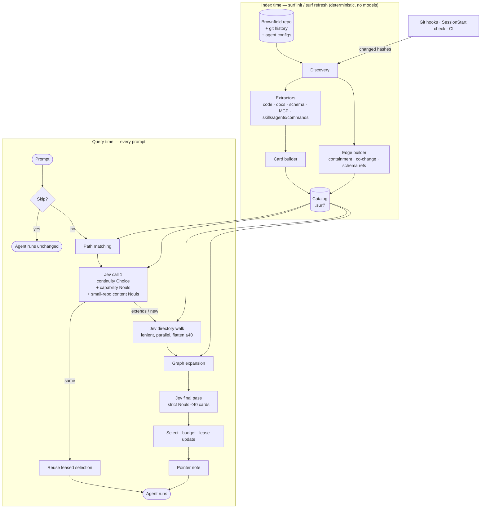
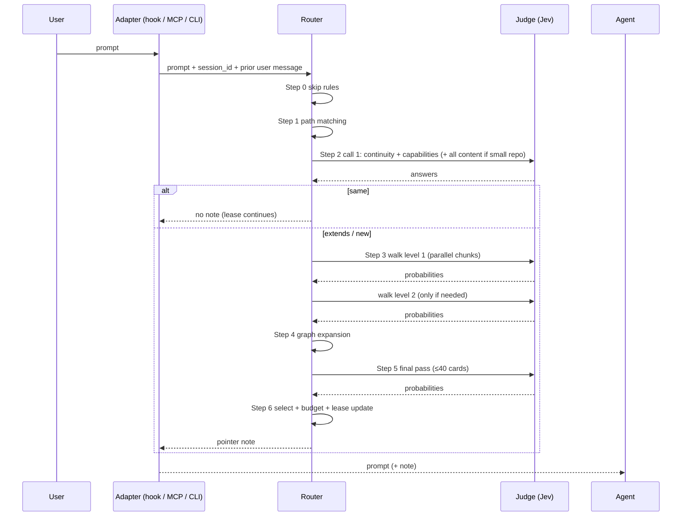
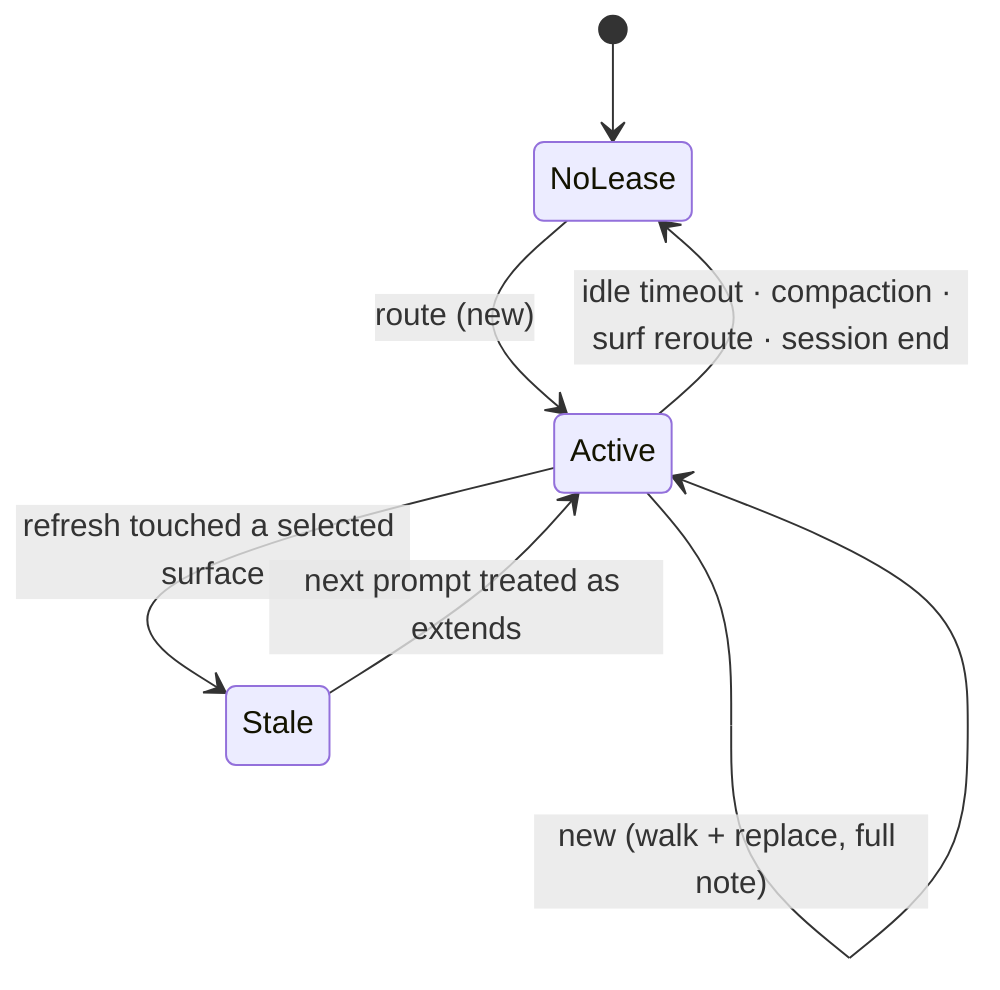

# Jev Surfer (`surf`): v1 Architecture & Development Spec

**Status:** v1 specification (supersedes the v0 design draft)
**Name:** Jev Surfer, CLI `surf` (renamed from "Surface Router"; see §0.1 on the name)
**Date:** September 23, 2026
**Decision model:** TypeSafe Jev (System One). Pin `jev-1.13.0` for all evaluation runs.
**Build approach:** Ground-up, harness-neutral engine. Borrows ideas from prior art, not code (see §4).

---

## Table of contents

0. [What changed from the v0 draft](#0-what-changed-from-the-v0-draft)
1. [Summary, goals and scope](#1-summary-goals-and-scope)
2. [Design principles](#2-design-principles)
3. [Decision log](#3-decision-log)
4. [Prior art and what we borrow](#4-prior-art-and-what-we-borrow)
5. [Architecture overview](#5-architecture-overview)
6. [Surface model](#6-surface-model)
7. [Indexer: discovery and cards](#7-indexer-discovery-and-cards)
8. [Edge builder](#8-edge-builder)
9. [Catalog storage](#9-catalog-storage)
10. [Refresh system](#10-refresh-system)
11. [Router: the per-prompt pipeline](#11-router-the-per-prompt-pipeline)
12. [The task lease](#12-the-task-lease)
13. [Judge interface](#13-judge-interface)
14. [Routing note format](#14-routing-note-format)
15. [Delivery and harness integration](#15-delivery-and-harness-integration)
16. [Configuration](#16-configuration)
17. [Evaluation](#17-evaluation)
18. [Observability](#18-observability)
19. [Security and privacy](#19-security-and-privacy)
20. [Jev limitations and design responses](#20-jev-limitations-and-design-responses)
21. [Failure modes and mitigations](#21-failure-modes-and-mitigations)
22. [Tech stack and package layout](#22-tech-stack-and-package-layout)
23. [Build plan](#23-build-plan)
24. [v2 roadmap and triggers](#24-v2-roadmap-and-triggers)
25. [Open questions](#25-open-questions)
26. [Glossary](#26-glossary)
27. [References](#27-references)

---

## 0. What changed from the v0 draft

The v0 draft was stress-tested component by component, and each part had to earn its place from first principles. The result is a leaner v1.

| Area | v0 draft | v1 | Why |
|---|---|---|---|
| Surface descriptions | LLM one-line summaries for every surface, verified by Jev | **Deterministic cards only.** No LLM anywhere in the index. | Summaries are the only lossy, costly, drift-prone and injectable signal. Generic summaries act as distractors for Jev. Most surface types already describe themselves. |
| Candidate generation | BM25 lexical prefilter → Jev | **Jev directory walk**, plus path matching on pasted content | Users rarely type exact identifiers, and BM25 fails on vocabulary mismatch. Jev handles natural language better. |
| Identifier lookup | Implied by the prefilter | **Path matching only** (stack traces, error output) | Pasted content is how identifiers actually reach prompts, and path matching needs no symbol index. |
| Jev passes | Surface-type pass, then per-candidate pass | **Call 1** (continuity + capabilities) → **walk** → **final pass** | Capability surfaces never match lexically, so they're always judged directly. Content surfaces go through the walk. |
| Edges | Imports, identifier references, migrations, doc mentions, MCP domain rules | **Containment, co-change, schema references** | All three are essentially language-agnostic. Code-symbol references deferred to v1.1. |
| Model tiers | Optional module | **Deferred to v2** | Separate problem and separate integration surface. Many harnesses can't enforce it mid-session. |
| Lease | Model-route lease | **Task lease in v1** via a three-way continuity Choice | Costs one extra question in a call already being made. Stabilizes context and saves tokens. |
| Build base | Fork jev-router | **Ground-up, harness-neutral engine** | The index and graph are the product, and no existing project has them. jev-router is hook-centric and per-user, and its repository listing showed no license file. |
| Evaluation | Phase 4 | **Phase 0** | Every threshold, cutoff and wording choice needs measurement, and evaluation gates every v2 addition. |

### 0.1 On the name

"Jev Surfer" replaces the working name "Surface Router". "Surfer" fits what the tool does (it navigates a project's surfaces), and the CLI stays `surf`. The "Jev" prefix follows the ecosystem's `jev-*` naming convention, which helps people find the project in the awesome-jev lists. It has two trade-offs:

- **It names one backend.** The judge interface (§13) lets a local model, an LLM or rules replace Jev. If backend neutrality becomes the main pitch, drop the prefix and ship as plain "Surfer".
- **Trademark.** "TypeSafe", "Jev" and "System One" are TypeSafe AI's names. Community projects state that they aren't affiliated. Before any public release, check TypeSafe's naming and brand guidelines, and add a non-affiliation note to the README.

---

## 1. Summary, goals and scope

### 1.1 What `surf` does

Jev Surfer is a tool you point at an existing ("brownfield") project. It:

1. **Indexes** every surface a coding agent might use:
   - **Content surfaces:** code files and directories, documentation, database schema (from migrations).
   - **Capability surfaces:** MCP servers, skills, subagents, slash commands.

   Each surface becomes a small, deterministic **card**. The indexer also builds a light **graph** of relationships between surfaces.
2. **Routes** each new task: Jev selects the smallest useful set of surfaces for the prompt.
3. **Directs** the agent's session with a single short note of **pointers**, telling the agent what is likely relevant and which capabilities it won't need.
4. **Stays fresh** automatically through git hooks and content hashing.
5. **Works with any agent stack.** A harness-neutral engine exposes a CLI and an MCP server. Thin adapters add automatic ("push") delivery where a harness supports hooks.

**Worked example.** Prompt: *"why do some orders never get a shipped date?"* (note that the prompt never says `shipped_at` or `supabase`). Desired note:

- **Code:** `src/fulfillment/ship.ts`, `src/api/orders/[id].ts`
- **Schema:** `orders`, `shipments`, plus the migration that added `shipped_at`
- **Docs:** `docs/fulfillment/shipping-lifecycle.md`
- **Capabilities:** use the Supabase MCP; not needed: Figma MCP, billing skills

### 1.2 Goals

| Goal | v1 target |
|---|---|
| Recall of must-have surfaces | ≥ 0.85 on held-out test queries |
| Pointer precision | Median note ≤ 12 pointers, 0 must-exclude violations |
| Latency, new task | p50 ≤ 1.5 s, p95 ≤ 3 s |
| Latency, continuing task | p50 ≤ 0.5 s |
| Cost | Well under $0.01 per routed prompt |
| Portability | Any harness via CLI or MCP. Automatic delivery for Claude Code in v1. |
| Language coverage | Any language for all v1 features (no per-language parsers) |
| Safety | Fail-open on every error path. Routing never grants permissions. |

### 1.3 In scope (v1)

- Indexer for code, docs, migration-based schema, MCP servers, skills, subagents and commands
- Deterministic cards for files, directories, tables and capabilities
- Graph edges: containment, co-change, schema references
- Router: skip rules, path matching, call 1 (continuity + capabilities), directory walk, graph expansion, final pass
- Task lease with a three-way continuity Choice
- Judge interface with a Jev backend (default), a local System One-compatible backend, an LLM judge (used for evaluation baselines), and a null backend
- Delivery: CLI, MCP server, instruction-file snippet, Claude Code hook adapter
- Refresh: git hooks, incremental re-indexing, a CI staleness check
- Evaluation: labeled dataset format, runner, metrics, ablations
- Decision log with privacy-preserving defaults

### 1.4 Out of scope (v1)

- LLM-generated summaries of any kind
- BM25, embeddings or any other fuzzy lexical or semantic prefilter
- Code-symbol extraction and reference edges (v1.1 candidate)
- Import graphs
- Model tier selection and model switching
- API-layer proxy delivery; hard MCP pruning at launch
- Push adapters for harnesses other than Claude Code (they use the MCP or CLI path in v1)
- Live database introspection
- Tool-risk gating or any permission enforcement

---

## 2. Design principles

1. **The index is deterministic.** Every card and edge comes from files, git history and tool listings, with no model involved. A deterministic index is cheap to build, exact, reproducible and trivially refreshable, and it can't hallucinate.
2. **Jev decides, code enforces.** Jev only makes bounded, typed judgments. Code owns thresholds, graph expansion, budgets, lease logic and fallbacks.
3. **Recall early, precision late.** Upper levels of the walk use lenient thresholds and wide beams. The final pass is strict.
4. **Pointers, not payloads.** The note tells the agent where to look. It never pastes file contents in v1.
5. **Never send Jev the whole index.** Every Jev request holds ≤ ~40 candidates, plus a small amount of context.
6. **Fail open.** Any error, timeout or low-confidence outcome means the agent runs exactly as it would without `surf`.
7. **Harness-neutral core.** The engine knows nothing about specific agents. Adapters are thin and optional.
8. **Measured, not claimed.** No threshold, wording or feature ships without an evaluation result behind it.

---

## 3. Decision log

Each decision includes the evaluation signal that would reopen it.

| # | Decision | Rationale | Revisit when |
|---|---|---|---|
| D1 | No LLM summaries in v1 | Lossy, costly, drift-prone, injectable. Generic summaries act as distractors. Docs, skills, MCP tools and tables already describe themselves. | Evaluation misses concentrate under generic-name directories (`lib/`, `common/`, `utils/`) |
| D2 | No BM25 or embeddings in v1 | Users rarely type exact identifiers. Vocabulary mismatch is common in brownfield code. It would be another ranker to tune. | New-task p50 latency > 1.5 s from walk depth, or root-level misses on natural-language queries |
| D3 | Jev directory walk as the candidate generator | Jev handles natural language. Parallel per level. Flattening keeps depth to 1–2 levels. | Layered-architecture recall stays below target after tuning |
| D4 | Path matching on prompt text | Stack traces and error output carry exact paths. It's a pure string match against stored paths. | Never; it's nearly free |
| D5 | Capability surfaces are never filtered | Small, flat sets. Capabilities rarely match prompt vocabulary. | A user has so many capabilities that call 1 exceeds latency targets |
| D6 | Skip the walk for small repos (≤ 60 content cards) | One or two calls cover everything. The walk adds latency without adding recall. | Evaluation shows the flat approach loses precision near the cutoff |
| D7 | Edges: containment, co-change, schema references | All effectively language-agnostic. Co-change bridges layered architectures. | Misses where an anchor was found but a related file with no co-change history was not |
| D8 | Code-symbol references deferred to v1.1 | Needs tree-sitter or ctags configuration. Cards work without symbols to start. | See D7; also if file cards prove too thin |
| D9 | Model tiers deferred to v2 | Separate problem. Weak enforcement in most harnesses. Couples routing to model-switching behavior. | v1 is stable and users ask for it |
| D10 | Task lease in v1 | One extra question in call 1. Stable context. Note injected once per task. | Continuity accuracy < 0.9 on sequences |
| D11 | Ground-up build | Index and graph are the product. Harness-neutral requirement. Licensing uncertainty on jev-router. | n/a |
| D12 | Evaluation in Phase 0 | Thresholds, wording and v2 gates all need it. Question wording can swing results dramatically. | n/a |
| D13 | Judge interface abstracts Jev | Vendor independence, local fallback, LLM baseline for evaluation | n/a |

---

## 4. Prior art and what we borrow

**Ideas only.** Before copying any code, check each project's license. The jev-router repository listing reviewed during design showed no LICENSE file, and code without a license can't be reused cleanly. jev-code-context-router and JevRouter are MIT-licensed.

| Project | Idea we borrow |
|---|---|
| [jev-router (0xSarnavo)](https://github.com/0xSarnavo/jev-router) | One batched Jev request carrying every question for a prompt. A one-line pointer note. Fail-open behavior. Benchmarking question wording. Local open-model fallback. |
| [jev-code-context-router](https://github.com/RemiCarbonne/jev-code-context-router) | Bounded, redacted shortlists before calling Jev. Local dependency expansion after Jev selects. Status codes for "no context found" outcomes. Claude Code hook injection via `additionalContext`. |
| [JevRouter](https://github.com/BillionsBobby/JevRouter) | MCP discovery via `initialize` + `tools/list`. Skill discovery via `SKILL.md` frontmatter. Decision-only default. Append-only decision records. |
| [blink](https://github.com/ellipsis-dev/blink) | Hierarchical, probability-weighted directory walking with Jev. |
| [jev-codex-router](https://github.com/0xNatoshi/jev-codex-router) | Leases that end on task boundaries, errors or compaction. Jev sees only a bounded decision state. |
| [jev-knowledge-base](https://github.com/jarodreyes/jev-knowledge-base) | A "needs context at all" gate before any retrieval. |
| [langchain-skill-router](https://github.com/deyna256/langchain-skill-router) | A judge protocol so Jev, a local model or static rules can be swapped in. |

---

## 5. Architecture overview



### 5.1 Components

| # | Component | When | Model? | Section |
|---|---|---|---|---|
| 1 | Discovery and extractors | index | none | §7 |
| 2 | Card builder | index | none | §7 |
| 3 | Edge builder | index | none | §8 |
| 4 | Catalog store | both | none | §9 |
| 5 | Refresh system | on change | none | §10 |
| 6 | Router | per prompt | Jev via judge | §11 |
| 7 | Lease manager | per prompt | Jev (one question) | §12 |
| 8 | Judge interface | per prompt | pluggable | §13 |
| 9 | Note builder | per prompt | none | §14 |
| 10 | Delivery (CLI, MCP, adapters) | per prompt | none | §15 |
| 11 | Evaluation harness | on demand, CI | via judge | §17 |
| 12 | Decision log | per prompt | none | §18 |

---

## 6. Surface model

### 6.1 Two kinds of surface

| | Content surfaces | Capability surfaces |
|---|---|---|
| Examples | Code files and dirs, docs, tables, migrations | MCP servers, skills, subagents, commands |
| Typical count | Hundreds to tens of thousands | Usually < 50, sometimes 100–150 |
| Shape | Hierarchical tree | Flat list |
| Matches prompt vocabulary? | Sometimes | Rarely ("supabase" is almost never in the prompt) |
| Routing | Path match → walk → expansion → final pass | Judged directly, every time, in call 1 |
| Note section | "Likely relevant" | "Use" / "Not needed" |

### 6.2 Surface types (v1)

| Type | Id prefix | Source |
|---|---|---|
| `code_dir` | `code:` (trailing `/`) | filesystem |
| `code_file` | `code:` | filesystem |
| `doc_dir` | `doc:` (trailing `/`) | filesystem (dirs where docs dominate) |
| `doc_file` | `doc:` | `*.md`, `*.mdx`, `*.rst`, `*.adoc`, `README*`, ADRs |
| `schema_root` | `db:` | virtual node grouping all tables |
| `db_table` | `db:` | parsed migrations or schema files |
| `db_migration` | `mig:` | migration files (also indexed as files) |
| `mcp_server` | `mcp:` | harness MCP configs |
| `skill` | `skill:` | `SKILL.md` |
| `subagent` | `agent:` | agent definition files |
| `command` | `cmd:` | slash-command / prompt files |

### 6.3 The unified content tree

The walk traverses **one tree** with a virtual root:

```
<root>
├── src/                 (code_dir)
├── docs/                (doc_dir)
├── supabase/            (code_dir, contains migrations)
├── README.md            (doc_file)
└── [schema]             (schema_root, virtual) → db_table children
```

Docs live inside the repo tree anyway, so they get walked alongside code. The schema appears as one virtual child of the root, with its tables as children. The walk treats it like any other wide directory (§11.5).

---

## 7. Indexer: discovery and cards

### 7.1 Discovery

1. Resolve the project root with `git rev-parse --show-toplevel`. Non-git projects are supported without co-change edges.
2. Enumerate files that git tracks, plus untracked files that aren't ignored. This respects `.gitignore`.
3. Apply **default excludes**:
   - dependency and vendor dirs: `node_modules/`, `vendor/`, `.venv/`, `venv/`, `target/`, `dist/`, `build/`, `.next/`, `out/`, `coverage/`, `__pycache__/`;
   - generated files and lockfiles: `*.lock`, `package-lock.json`, `*.min.*`, `*.map`, snapshots;
   - binary files (detected by extension and a null-byte check);
   - **secret-like files:** `.env*`, `*.pem`, `*.key`, `id_rsa*`, `*credentials*`, `*secret*`;
   - user excludes from `config.toml`.
4. Detect agent configuration locations (§7.6).

### 7.2 Card design rules

- **Deterministic:** derived only from paths, file metadata, parsed structure, git history and tool listings.
- **Budgeted:** file cards ≤ ~60 tokens, directory cards ≤ ~150 tokens, capability cards ≤ ~120 tokens. Truncate deterministically: sort, cap, then add a "+N more" marker.
- **Concrete nouns over prose:** names, titles, tables and tool names. No adjectives.
- **Sanitized:** strip control characters, collapse whitespace, cap string lengths, and drop anything matching secret patterns (§19.3).

### 7.3 Code file cards

| Field | Source | Notes |
|---|---|---|
| `path` | filesystem | always |
| `lang` | extension map | e.g. `ts`, `py`, `go`, `sql` |
| `lines` | line count | bucketed: `<50`, `<200`, `<500`, `<1500`, `1500+` |
| `tables` | schema-reference edges (§8.3) | top 3 by weight |
| `changes_with` | co-change edges (§8.2) | top 3 partner paths (basenames when unambiguous) |
| `churn` | commit count in the co-change window | bucketed: `low` / `med` / `high` |

Rendered for Jev:

```
src/fulfillment/ship.ts [ts, <200 lines]
tables: orders, shipments
changes with: api/orders/[id].ts, events/shipment.ts, docs/fulfillment/shipping-lifecycle.md
```

In v1, code file cards deliberately **don't** include symbols (deferred to v1.1) or header comments. Header comments are an injection vector, and they're effectively unsanitized prose.

### 7.4 Doc file cards

| Field | Source |
|---|---|
| `path` | filesystem |
| `title` | first H1, else frontmatter `title`, else file name |
| `headings` | H2s, up to 8 (H3s only if there are fewer than 3 H2s) |
| `tables` | schema references found in the doc |
| `changes_with` | top 3 co-change partners |

```
docs/fulfillment/shipping-lifecycle.md — "Shipping lifecycle"
sections: Order states · Label creation · Carrier webhooks · Backfills · Known issues
tables: orders, shipments
```

### 7.5 Schema cards

**Source (v1): migration and schema files only.** No live database connection. Supported inputs:

| Stack | Location | Parser |
|---|---|---|
| Plain SQL / Supabase | `supabase/migrations/*.sql`, `migrations/*.sql`, `db/*.sql` | `sqlglot` (DDL: `CREATE/ALTER/DROP TABLE`, `CREATE VIEW`, `CREATE POLICY`) |
| Prisma | `prisma/schema.prisma` | Prisma schema parser (small grammar) |
| Rails | `db/schema.rb` | regex over the `create_table` DSL |
| Django | `*/migrations/*.py` | deferred; fall back to model file names |
| Alembic | `alembic/versions/*.py` | `op.create_table` / `op.add_column` regex |
| Drizzle | `drizzle/*.sql` or schema TS | SQL output if present |

Migrations are replayed **in order** to compute the current table set, so dropped and renamed tables resolve correctly. Unparseable statements are logged and skipped, never fatal.

**Table card:**

```
table orders — 14 columns
columns: id, customer_id, status, total_cents, created_at, shipped_at, +8
fk: customer_id → customers, shipment_id → shipments
policies: orders_select_own, orders_update_admin
defined in: 20250302_init.sql · last changed: 20260611_add_shipments.sql
```

**Schema root card** (the virtual node): `database schema — 41 tables: customers, orders, shipments, products, … +33`.

### 7.6 Capability cards

**MCP servers:**

1. Read the harness configs that exist: `.mcp.json`, `.claude/settings*.json`, `.cursor/mcp.json`, `~/.codex/config.*`, OpenCode config, and user-level configs if the user opts in.
2. **Static mode (default at init):** record the server name, transport, and the command or URL. Nothing is executed.
3. **Live mode (opt-in per server):** spawn a stdio server, or connect to an HTTP one, and call `initialize` and `tools/list`. Record the server's instructions and tool names and descriptions. **Never call tools.** Keep secrets in the child environment only.
4. For servers that can't be listed (they need OAuth, or live mode is declined), `surf init` asks the user for **one line** describing what the server is for, and stores it in `config.toml`. This is the only hand-written text in the system.

```
mcp supabase — tools: execute_sql, list_tables, list_migrations, get_logs, apply_migration, +4
purpose: Postgres/Supabase project access (read-only intended)
```

**Skills, subagents, commands:** name plus the `description` from frontmatter. If there's no description, use the first paragraph, capped at 200 characters.

```
skill db-migrations — Write and review Supabase SQL migrations with RLS conventions
```

### 7.7 Directory cards

A directory card is how the walk "sees" a subtree. It's built bottom-up from its children:

| Field | Rule |
|---|---|
| `path` | always |
| `files_total` | recursive count |
| `langs` | top 3 languages by file count |
| `child_dirs` | up to 12 names, ordered by recursive file count |
| `child_files` | up to 15 names, ordered by churn, then size |
| `tables` | top 5 tables referenced anywhere in the subtree, weighted |
| `doc_titles` | for doc-heavy dirs: up to 6 titles |
| `coupled_dirs` | top 3 **other** directories this subtree co-changes with (§8.2.5) |

```
src/services/ — 84 files · ts
dirs: billing/, fulfillment/, auth/, notifications/, inventory/
files: shipping.ts, orders.ts, refunds.ts, email.ts, +23
tables: orders, shipments, customers, refunds
changes with: src/api/orders/, supabase/migrations/, docs/fulfillment/
```

`coupled_dirs` is the key feature for layered architectures. It lets Jev see that `src/services/` travels with `src/api/orders/`, even when the directory names say nothing about the feature.

### 7.8 Hashing

Each card has a `hash` computed over its **card inputs**, not raw bytes:
- file cards: path + line bucket + extracted tables;
- docs: title + headings;
- tables: parsed definition;
- capabilities: listing and description.

Edge-derived fields (`changes_with`, `coupled_dirs`) are recomputed with the edges (§10). A whitespace-only edit doesn't change the hash.

---

## 8. Edge builder

### 8.1 Containment

- **Source:** the filesystem tree and the virtual schema root.
- **Language work:** none.
- **Use:** walk structure, and sibling expansion (a selected file can pull in its directory's README or index file).
- **Record:** `{from: parent, to: child, kind: "contains", weight: 1.0}`.

### 8.2 Co-change

Files that repeatedly change in the same commits are functionally related, whatever their language or location.

**8.2.1 Extraction**

```bash
git log --no-merges --name-status -M -C --since="<window>" --format="%H%x09%at"
```

- `-M -C` detects renames and copies. Renames are followed so history carries across moves.
- The window is 24 months or 5,000 commits, whichever comes first (configurable).

**8.2.2 Commit filters (noise control)**

| Filter | Default | Why |
|---|---|---|
| Max files per commit | 30 | Formatting passes, dependency bumps and mass renames couple everything |
| Exclude paths | lockfiles, generated files, excluded dirs | They aren't surfaces |
| Exclude bot authors | `dependabot`, `renovate`, `github-actions` | Mechanical changes |
| Exclude message patterns | `^(chore|style|format)`, `prettier`, `lint` | Mechanical changes |

**8.2.3 Weighting**

For each commit *c* with age *t_c* (days), the recency weight is:

  w(c) = exp(−t_c / H), with half-life H ≈ 180 days (configurable)

For files *a* and *b*:

- W(a) = Σ w(c) over commits touching *a*
- W(a,b) = Σ w(c) over commits touching both *a* and *b*
- **coupling(a, b) = W(a,b) / √(W(a) · W(b))**

This is a recency-weighted cosine similarity, bounded in [0, 1]. The square root keeps a high-churn file from dominating its partners.

**8.2.4 Pruning**

- Keep an edge only if raw shared commits ≥ 2 **and** coupling ≥ 0.15.
- Keep the top 10 partners per file.
- Store the edge symmetrically.

**8.2.5 Directory coupling**

For directories *D* and *E* that aren't ancestors of each other, aggregate the file-level co-change weights between them, normalized the same way. Keep the top 5 per directory. This feeds `coupled_dirs` on directory cards.

**8.2.6 Caveats**

- Young repos and shallow clones have weak history. `surf doctor` warns when there are < 200 commits and suggests `git fetch --unshallow`.
- Squash-merge workflows are fine: one squashed PR is one coherent change.
- A monorepo with independent packages may need per-package windows (v2, §24).

### 8.3 Schema references

Links tables to the code and docs that use them.

**8.3.1 Name variants per table**

| Variant | Example (`order_items`) | Weight multiplier |
|---|---|---|
| exact | `order_items` | 1.0 |
| quoted SQL context | `"order_items"`, `from('order_items')`, `FROM order_items`, `JOIN order_items` | 1.5 |
| singular | `order_item` | 0.6 |
| PascalCase singular | `OrderItem` | 0.6 |
| camelCase | `orderItems` | 0.6 |

**8.3.2 Search**

Run a word-boundary text search (ripgrep, or Python regex with an Aho-Corasick prefilter) across all indexed files. This is language-agnostic. The only format-specific work is on the extraction side (§7.5).

**8.3.3 Specificity weighting**

Common table names (`users`, `orders`, `status`, `events`) match everywhere. Weight by rarity, like inverse document frequency in search:

  specificity(t) = log(1 + N_files / (1 + df(t)))

where *df(t)* is the number of files mentioning any variant of *t*. Then, for a file *f* with *n* mentions of table *t*:

  weight(f, t) = min(1, 0.25 + 0.25 · log(1 + n)) × variant multiplier × normalized specificity(t)

**8.3.4 Noise guards**

- Ignore table names shorter than 4 characters, or on a stopword list (`data`, `items`, `logs`, `status`, `type`, `meta`), **unless** the match is in a quoted SQL context.
- Ignore matches in comments only when a cheap per-extension comment regex exists. Otherwise keep them; the specificity weighting handles most of the noise.
- Cap at 20 tables per file and 200 files per table (keep the highest weights).

**8.3.5 Records**

- `{from: "db:orders", to: "code:src/fulfillment/ship.ts", kind: "schema_ref", weight: 0.82}`
- Migration links: `{from: "db:orders", to: "mig:supabase/migrations/20260611_add_shipments.sql", kind: "defined_in", weight: 1.0}`
- Foreign keys: `{from: "db:orders", to: "db:customers", kind: "fk", weight: 0.7}`

### 8.4 Deferred edge types

| Edge | Target | Work required |
|---|---|---|
| Code-symbol references | v1.1 | tree-sitter "tags" queries or universal-ctags for definitions (per-language configuration, not code), then text search for references, with a rarity filter on short or generic names |
| Imports | v2 | Per-language resolution (module paths, aliases, barrels) |
| Doc → code mentions (by path) | v1.1 | Language-agnostic: search docs for paths and file names. Cheap; candidate for early addition. |

### 8.5 Expansion scoring (used at query time)

Given selected anchors *A* (from the walk or path matches), each non-anchor neighbor *n* gets:

  expand_score(n) = max over a ∈ A of [ edge_weight(a, n) × kind_factor(kind) × anchor_strength(a) ]

| Kind | kind_factor |
|---|---|
| co_change | 1.0 |
| schema_ref (table → file, file → table) | 0.9 |
| defined_in | 0.8 |
| fk | 0.5 |
| contains (dir → README/index only) | 0.6 |

Here `anchor_strength` is the anchor's walk probability, or 1.0 for path matches. Neighbors with `expand_score ≥ 0.3` (tunable) join the final-pass candidates. Expansion depth is 1 in v1.

---

## 9. Catalog storage

### 9.1 Layout

```
.surf/
├── config.toml             # committed — settings (§16)
├── catalog.jsonl           # committed by default — one card per line
├── edges.jsonl             # committed by default — one edge per line
├── meta.json               # committed — schema_version, index HEAD, counts, build time
├── eval/
│   ├── dev.yaml            # committed — tuning queries
│   └── test.yaml           # committed — held-out queries (never tune on these)
├── cache/                  # gitignored
│   ├── index.sqlite        # fast lookup: ids, paths, children, edges by node
│   ├── cochange.state      # last processed commit for incremental co-change
│   └── leases/             # per-session lease files (§12)
└── logs/                   # gitignored
    └── decisions.jsonl     # per-prompt decision records (§18)
```

### 9.2 Card record

```json
{
  "id": "code:src/fulfillment/ship.ts",
  "type": "code_file",
  "path": "src/fulfillment/ship.ts",
  "parent": "code:src/fulfillment/",
  "card": "src/fulfillment/ship.ts [ts, <200 lines]\ntables: orders, shipments\nchanges with: api/orders/[id].ts, events/shipment.ts, docs/fulfillment/shipping-lifecycle.md",
  "fields": { "lang": "ts", "lines_bucket": "<200", "tables": ["orders", "shipments"], "churn": "med" },
  "hash": "sha256:9f2c…",
  "indexed_at": "2026-09-23T21:40:00Z"
}
```

`card` holds the exact text Jev sees. It's stored rather than rendered at query time, so what was routed can be reproduced.

### 9.3 Edge record

```json
{ "from": "code:src/fulfillment/ship.ts", "to": "code:src/api/orders/[id].ts", "kind": "co_change", "weight": 0.61, "evidence": { "shared_commits": 9 } }
```

### 9.4 Meta record

```json
{
  "schema_version": 1,
  "surf_version": "0.1.0",
  "index_head": "a1b2c3d",
  "cochange_head": "a1b2c3d",
  "counts": { "code_file": 1840, "code_dir": 212, "doc_file": 96, "db_table": 41, "mcp_server": 4, "skill": 18 },
  "content_cards": 2189,
  "walk_mode": "walk",
  "built_at": "2026-09-23T21:40:00Z"
}
```

### 9.5 Commit or ignore?

**Default: commit** `catalog.jsonl`, `edges.jsonl` and `meta.json`. Teammates and CI get routing without re-indexing, and diffs show how the index changed. For very large monorepos, catalogs over about 20 MB, or teams that dislike the churn, set `index.commit_catalog = false`. The catalog then lives in `cache/` and is rebuilt locally or in CI.

The SQLite cache is always derived from the JSONL files, so it can be deleted safely.

---

## 10. Refresh system

The index is deterministic, so refreshing is cheap: re-parse, re-hash, recompute the affected edges.

### 10.1 Triggers

| Trigger | Mechanism | Action |
|---|---|---|
| Commit, merge, checkout, rebase | Git hooks: `post-commit`, `post-merge`, `post-checkout`, `post-rewrite` | `surf refresh --changed` in the background (non-blocking, lockfile-guarded) |
| Session start | Claude Code `SessionStart` hook, or the first CLI/MCP call of a session | Compare `index_head` to `HEAD` plus working-tree status. If stale, refresh incrementally (time-boxed to 3 s), else warn. |
| Agent config change | Hash of the MCP, skill, agent and command config files | Rebuild capability cards |
| New migration file | Path pattern match within the changed set | Replay migrations, rebuild table cards and schema edges |
| CI | `surf index --check` | Fail if the committed catalog doesn't match a fresh build |
| Manual | `surf index` / `surf refresh` | Full or incremental rebuild |

Git hooks are installed alongside existing hooks without replacing them. If a hook manager is present (husky, lefthook, pre-commit), `surf init` adds an entry there instead.

### 10.2 Incremental algorithm

```
changed_files = git diff --name-status <index_head>..HEAD  ∪  working-tree changes
removed       = deleted or renamed-away paths
added         = new paths (post-exclude)

1. For removed: delete their cards and any edges touching them.
2. For added ∪ modified: re-extract and rebuild cards. Skip if the hash is unchanged.
3. If any migration or schema file changed: replay migrations → rebuild db_table cards.
4. Schema references: re-scan changed files for all table variants.
   If the table set changed: re-scan all files for the new or renamed tables only.
5. Co-change: process commits from cochange_head..HEAD; update the affected pairs;
   apply decay by re-weighting at read time (store t_c, not w(c)).
6. Recompute cards for ancestors of every changed node (directory cards roll up).
7. Recompute changes_with / coupled_dirs fields for nodes whose edges changed.
8. Update meta.json heads and counts.
```

### 10.3 Staleness during a session

If a refresh modifies or deletes a surface that's in the current lease, mark the lease **stale** (§12.4). The next prompt is then treated as `extends`, so pointers are re-validated.

---

## 11. Router: the per-prompt pipeline

### 11.1 Overview



**Speculative execution:** walk level 1 is fired **in parallel** with call 1, and its result is discarded if call 1 says `same`. The extra cost is negligible, and it removes one round trip from the new-task path.

### 11.2 Step 0: skip rules (no Jev call)

Skip routing entirely when:
- the prompt is a short acknowledgement or continuation (≤ 4 words matching an ack list: "ok", "thanks", "continue", "go ahead", "yes", "lgtm"), **and** a lease exists;
- the prompt is a `surf` control command (`surf off`, `surf status`, `surf reroute`, …), which the adapter handles directly;
- routing is disabled for the session or project;
- the index is missing or corrupt. Fail open and log it.

### 11.3 Step 1: path matching

Extract path-like tokens from the prompt text, which covers pasted stack traces, compiler errors, test output and logs:

1. Regex for path-like tokens: segments separated by `/` or `\`, with an extension, optionally followed by `:line[:col]` or `(line,col)`.
2. **Normalize:**
   - convert backslashes to `/`;
   - strip `:line:col` suffixes;
   - strip `file://`;
   - strip absolute prefixes by longest-suffix match against catalog paths, which handles `/app/src/...`, `/home/runner/work/repo/repo/src/...` and `C:\Users\...\repo\src\...`;
   - strip `webpack://` and similar bundler prefixes.
3. Match against catalog paths:
   - exact suffix match → **path hit** (anchor_strength 1.0);
   - basename-only match with a unique basename in the repo → hit (0.8);
   - ambiguous basename → a candidate for the final pass, not an anchor.
4. Dedupe, and cap at 10 path hits (stack traces repeat frames). Prefer frames from non-test, non-framework paths.

Path hits skip the walk for their subtree. They go straight to expansion and the final pass, and they're always included in the note unless the final pass scores them below 0.2. Stack traces sometimes include incidental frames.

### 11.4 Step 2: Jev call 1

One request, with all questions evaluated in parallel over the same state.

**State:**
- `request`: the current prompt (redacted, §19.3; truncated to about 1,500 tokens, keeping the head and the tail);
- `previous_task`: the lease's originating request (if a lease exists);
- `last_message`: the previous user message (if any);
- `project`: a one-line project descriptor from `config.toml`, or auto-derived (for example "TypeScript + Supabase web app").

**Questions:**

| Key | Type | When included | Instruction (initial wording, tune via evaluation) |
|---|---|---|---|
| `continuity` | Choice: `same` / `extends` / `new` | lease exists | "How does the current request relate to the previous task? `same`: continues the same work with no new area of the project. `extends`: same overall goal but involves a new area, file type, or capability. `new`: a different task." |
| `needs_context` | Noul | always | "Answering the request requires information about this specific project's files, documentation, or database." |
| `cap:<id>` | Noul, one per capability | always | "Completing the request likely requires using this capability: {card}" |
| `file:<id>` | Noul, one per content card | small-repo mode only | "This item likely contains information needed for the request: {card}" |

If there are more than 40 capability surfaces, split them into parallel requests of ≤ 40, each repeating the state.

**Illustrative request** (confirm field names against the [TypeSafe docs](https://docs.typesafe.ai/primitives) during Phase 1):

```json
{
  "model": "jev-1.13.0",
  "state": {
    "request": "why do some orders never get a shipped date?",
    "project": "TypeScript + Supabase e-commerce backend"
  },
  "questions": {
    "needs_context": { "type": "noul", "instructions": "Answering the request requires information about this specific project's files, documentation, or database." },
    "cap:mcp:supabase": { "type": "noul", "instructions": "Completing the request likely requires using this capability: mcp supabase — tools: execute_sql, list_tables, list_migrations, get_logs … purpose: Postgres/Supabase project access" },
    "cap:mcp:figma": { "type": "noul", "instructions": "Completing the request likely requires using this capability: mcp figma — tools: get_file, get_node, export_image … purpose: design files" },
    "cap:skill:db-migrations": { "type": "noul", "instructions": "Completing the request likely requires using this capability: skill db-migrations — Write and review Supabase SQL migrations with RLS conventions" }
  }
}
```

**Decision rules (in code):**

| Outcome | Action |
|---|---|
| `continuity = same` with confidence ≥ 0.6 | Reuse the lease, inject no note, **stop** |
| `continuity = same` with confidence < 0.6 | Treat as `extends` (the safe middle) |
| `continuity = extends` | Walk, then **union** the result with the lease |
| `continuity = new`, or no lease | Walk, then **replace** the lease |
| `needs_context < 0.25` and no path hits | Emit capability lines only, no content pointers |
| Small-repo mode | Content Nouls already answered, so skip Step 3 and go to Step 4 |

Capability selection: **use** if the Noul is ≥ 0.6, **not needed** if ≤ 0.15, and unmentioned in between. The asymmetry is deliberate: telling an agent not to use something it needs costs more than an unmentioned capability.

### 11.5 Step 3: the directory walk

**Purpose:** narrow a tree of thousands of content cards down to ≤ ~40 plausible candidates using Jev's natural-language judgment. It is lenient by design, because precision is the final pass's job.

**Parameters (defaults; all tunable in config and via evaluation):**

| Parameter | Default | Meaning |
|---|---|---|
| `small_repo_cutoff` | 60 | Content cards at or below this count skip the walk |
| `flatten_at` | 40 | A selected subtree with ≤ this many files is flattened into final candidates |
| `chunk_size` | 40 | Maximum children per Jev request |
| `tau_walk` | 0.35 | Selection threshold at walk levels (lenient) |
| `beam_max` | 6 | Maximum children expanded per node |
| `beam_min` | 1 | Minimum children expanded when `needs_context` is high (dead-end guard) |
| `max_depth` | 4 | Hard depth cap |
| `max_candidates` | 40 | Final-pass input cap |
| `deadline_ms` | 2,000 | Walk time budget; return the best-so-far when it's exceeded |

**Algorithm:**

```python
def walk(root, state, cfg, path_hit_subtrees):
    frontier = [(root, 1.0)]          # (node, cumulative probability)
    candidates = {}                    # file_id -> score
    depth = 0
    while frontier and depth < cfg.max_depth and not deadline_passed():
        next_frontier = []
        # Build one question set per frontier node; chunk wide nodes; run ALL in parallel
        batches = []
        for node, p_parent in frontier:
            kids = [k for k in children(node) if k not in path_hit_subtrees]
            for chunk in chunks(kids, cfg.chunk_size):
                batches.append((node, p_parent, chunk))
        results = judge.ask_many([
            build_walk_request(state, breadcrumb(node), chunk) for node, _, chunk in batches
        ])
        for (node, p_parent, chunk), answers in zip(batches, results):
            scored = sorted(((k, answers[k.id]) for k in chunk), key=lambda x: -x[1])
            chosen = [(k, p) for k, p in scored if p >= cfg.tau_walk][: cfg.beam_max]
            if not chosen and state.needs_context >= 0.5:
                chosen = scored[: cfg.beam_min]           # dead-end guard, flagged low-confidence
            for k, p in chosen:
                score = p_parent * p
                if k.is_file:
                    candidates[k.id] = max(candidates.get(k.id, 0), score)
                elif k.files_total <= cfg.flatten_at:
                    for f in all_files(k):                 # flatten small subtree
                        candidates[f.id] = max(candidates.get(f.id, 0), score * 0.9)
                else:
                    next_frontier.append((k, score))
        frontier = next_frontier
        depth += 1
    return candidates
```

**Request shape at each walk node:**
- **State:** `request`, `project`, and `location` (the breadcrumb, e.g. `root › src › services`).
- **Questions:** one Noul per child: "This item likely contains information needed for the request: {child card}". Child cards are directory cards for directories, and file or doc cards for files.

**Handling wide directories and the schema.** When a node has more than `chunk_size` children, they're split into parallel requests. The schema root, with its table children, is handled the same way. Chunks are ordered by churn, so the most active items are grouped together. This doesn't affect scoring, only request composition.

**Why the math is structured this way:**
- `p_parent × p` (cumulative probability) ranks deep candidates below shallow confident ones when the final-pass input has to be truncated.
- Flattened files get a 0.9 factor. They were admitted as a group, not individually judged.
- Threshold asymmetry (0.35 in the walk vs. 0.6 in the final pass) puts recall early and precision late.

**Expected latency:** with flattening at 40, most repos with 500–5,000 files need 1–2 walk levels. With level 1 run speculatively (§11.1), a new task costs about 2–3 sequential Jev round trips in total.

### 11.6 Step 4: graph expansion

Anchors are path hits plus walk candidates. For each anchor, gather depth-1 neighbors via co-change, schema_ref, defined_in, fk and README containment edges, and score them with the formula in §8.5.

- Neighbors scoring ≥ 0.3 join the candidate pool.
- **Tables:** if a code candidate has schema_ref edges, its top tables join the pool as `db_table` candidates. This is how the schema reaches the note without the walk ever entering `[schema]`.

**Pool ranking for the final pass** (when the pool exceeds `max_candidates`):
1. path hits;
2. walk candidates, by cumulative score;
3. expansion candidates, by expand_score.

Truncate to 40.

### 11.7 Step 5: final pass

One request, or two in parallel if the pool is split for mixed types. It's strict.

- **State:** `request`, `project`.
- **Questions:** one Noul per candidate: "This item is needed to answer or complete the request: {card}".

The wording here is deliberately stricter ("is needed") than in the walk ("likely contains"). Treat both as initial wordings to tune (§17.6).

### 11.8 Step 6: selection and budget

| Rule | Default |
|---|---|
| Select a content surface if its final Noul is | ≥ `tau_final` = 0.6 |
| Path hits are kept unless their final Noul is | < 0.2 |
| Maximum content pointers | 12 |
| Priority when over budget | path hits → highest final Noul → type diversity (keep at least one each of code/doc/table if present and above threshold) |
| Directory collapse | If ≥ 4 selected files share a parent dir that has ≤ 8 files, point to the directory instead |
| Nothing above threshold | Emit capability lines only. Status `no-candidates`. |

Then update the lease (§12) and build the note (§14).

### 11.9 Latency and cost budget (targets)

| Path | Sequential Jev round trips | Target p50 |
|---|---|---|
| Skip | 0 | < 20 ms |
| `same` (lease reuse) | 1 | ≤ 0.5 s |
| Small repo, new task | 1–2 | ≤ 1.0 s |
| Walk repo, new task | 2–4 (level 1 speculative) | ≤ 1.5 s |

**Cost:** a new-task route in a mid-size repo sends roughly 10–30k Jev input tokens in total across calls. At $0.042 per million input tokens (output is free), that's about $0.001 or less per route. Latency is the binding constraint, not cost.

**Hard deadline:** 3 s end to end. When it passes, return the best-so-far selection if the final pass has run, otherwise capabilities only. Fail open beyond that.

---

## 12. The task lease

### 12.1 What it is

A **lease** caches the last routing result, keyed to the current **task** rather than the exact prompt text. While the lease holds, follow-up prompts reuse the selection with no walk and no new note. Its purpose:

1. **Latency:** follow-ups cost one fast call.
2. **Stability:** the agent's picture of what's relevant doesn't shuffle mid-task.
3. **Tokens:** the note is injected once per task, not once per turn, which avoids near-duplicate notes piling up in context.

### 12.2 Lease record

```json
{
  "session_id": "cc-7f3a…",
  "task_request": "why do some orders never get a shipped date?",
  "started_at": "2026-09-23T21:48:02Z",
  "last_used_at": "2026-09-23T21:55:40Z",
  "index_head": "a1b2c3d",
  "selection": {
    "content": ["code:src/fulfillment/ship.ts", "db:orders", "doc:docs/fulfillment/shipping-lifecycle.md"],
    "capabilities_use": ["mcp:supabase"],
    "capabilities_not_needed": ["mcp:figma"]
  },
  "stale": false,
  "generation": 2
}
```

Stored at `.surf/cache/leases/<session_id>.json`.

### 12.3 State transitions



### 12.4 Rules

| Event | Behavior |
|---|---|
| `same` (conf ≥ 0.6) | Reuse; inject nothing |
| `extends` | Walk; union the new content (still capped at 12, newest first); inject a **delta note** listing only additions |
| `new` | Walk; replace; inject a full note |
| Low-confidence continuity | Treat as `extends` |
| Refresh modifies or deletes a selected surface | Mark stale → next prompt treated as `extends`; drop deleted ids |
| Idle > 45 min (configurable) | Expire |
| Compaction or session restart | Expire, where the harness exposes the event. Otherwise rely on the idle timeout. |
| `surf reroute` | Expire and route the current prompt as `new` |

### 12.5 Session identity (harness-neutral)

| Delivery | session_id source |
|---|---|
| Claude Code hook | Session id from the hook payload |
| MCP server | Optional `session_id` argument, else per MCP connection |
| CLI | `--session <id>`, else `SURF_SESSION` env, else leases disabled |
| No id available | Leases disabled; every prompt routes as `new` (still correct, just less efficient) |

---

## 13. Judge interface

### 13.1 Contract

```python
from typing import Protocol, Literal, Mapping, Sequence

class NoulQ:   type: Literal["noul"];   instructions: str
class ChoiceQ: type: Literal["choice"]; instructions: str; options: Mapping[str, str]

class NoulA:   p: float                                        # P(yes)
class ChoiceA: choice: str; probs: Mapping[str, float]; confidence: float

class Judge(Protocol):
    name: str
    def ask(self, state: Mapping, questions: Mapping[str, NoulQ | ChoiceQ],
            *, timeout_ms: int) -> Mapping[str, NoulA | ChoiceA]: ...
    def ask_many(self, requests: Sequence[tuple[Mapping, Mapping]],
                 *, timeout_ms: int) -> Sequence[Mapping[str, NoulA | ChoiceA]]: ...
```

The router speaks only this interface. Thresholds are stored **per judge backend**, because probabilities aren't comparable across backends (or between Noul and Choice, even within Jev).

### 13.2 Backends

| Backend | Use | Notes |
|---|---|---|
| `jev` (default) | Production | Providers: TypeSafe direct, OpenRouter, Vercel AI Gateway, Cloudflare. Pin the model version. Retry once on 5xx or timeout, then fail open. |
| `systemone-local` | Offline, privacy-sensitive | Any `/v1/systemone`-compatible endpoint (community open reproductions). Expect lower accuracy, especially with many options. Evaluate before relying on it. |
| `llm` | Evaluation baseline only | Structured-output LLM that returns probabilities. Measures whether Jev earns its dependency (§17.5). |
| `null` | Fail-open, tests | Returns "no decision"; the router emits nothing. |
| `fixture` | Unit tests | Replays recorded responses deterministically. |

### 13.3 Resilience

- Per-request timeout: 1,200 ms. Global route deadline: 3 s.
- Concurrency limit: 16 in-flight requests (configurable) to respect provider rate limits.
- Circuit breaker: after 3 consecutive failures, skip the judge for 60 s and fail open.
- Every failure is logged with its status code (§18).

---

## 14. Routing note format

### 14.1 Full note (new task)

```
[surf] Likely relevant — open as needed, nothing is preloaded:
  code:   src/fulfillment/ship.ts · src/api/orders/[id].ts
  schema: orders · shipments (migration: supabase/migrations/20260611_add_shipments.sql)
  docs:   docs/fulfillment/shipping-lifecycle.md
  use:    supabase MCP
  skip:   figma MCP · billing-reports skill
(surf routed this task; use your normal search if these don't cover it)
```

### 14.2 Delta note (extends)

```
[surf] Also relevant for this part of the task:
  code: src/notifications/email/shipment-confirmation.ts
  docs: docs/notifications/templates.md
```

### 14.3 Rules

- Plain text, ≤ 15 lines, no file contents.
- Relative paths from the repo root.
- The fallback line ("use your normal search…") is always present in full notes. Routing is a head start, not a ceiling.
- "skip" lines are advisory. Hard pruning of MCP tools is out of scope for v1.
- Low-confidence routes (dead-end guard fired, or walk deadline hit) add: `(low confidence — verify before relying on these)`.

---

## 15. Delivery and harness integration

### 15.1 Levels

| Level | Mechanism | Coverage | Push or pull | v1 |
|---|---|---|---|---|
| 0a | **CLI** `surf route --json` | Any script, CI, custom agent | Pull | ✅ |
| 0b | **MCP server** exposing `route_context` | Any MCP-capable harness | Pull (the agent calls it) | ✅ |
| 0c | **Instruction snippet** in `AGENTS.md` / `CLAUDE.md` / `.cursorrules` / etc. telling the agent to call `route_context` at task start | Any harness that reads instruction files | Makes the pull reliable | ✅ |
| 1 | **Hook adapters** that inject the note automatically | Claude Code (v1); Codex, OpenCode, others in v2 | Push | ✅ Claude Code |
| 2 | **API proxy** that injects notes, with model rewrite in v2 | Any harness with a configurable base URL | Push | ❌ v2 |

### 15.2 MCP server

Tools exposed:

| Tool | Input | Output |
|---|---|---|
| `route_context` | `request` (string), `session_id?`, `previous_message?` | `{status, note, selection, continuity, route_id}` |
| `surface_info` | `id` or `path` | The card plus its top edges (lets the agent ask why something is related) |
| `surf_status` | none | Index freshness, judge backend, counts |

Transport: stdio by default, with an optional local HTTP listener. The server never executes project code or other MCP tools.

### 15.3 Instruction snippet (level 0c)

Added by `surf init` to whichever instruction files exist. It's appended in a marked block and never replaces existing content:

```markdown
<!-- surf:begin -->
## Project navigation (surf)
At the start of each new task, call the `route_context` tool with the user's request
before searching the repository. Treat its pointers as a starting point, not a limit.
<!-- surf:end -->
```

### 15.4 Claude Code adapter (level 1 reference implementation)

| Hook | Purpose |
|---|---|
| `UserPromptSubmit` | Run the router. Return the note as `hookSpecificOutput.additionalContext` (nothing for `same` or skip). |
| `SessionStart` | Check index freshness; incremental refresh if stale (§10.1); clear expired leases. |
| `Stop` (optional) | Record which pointed files the agent actually opened, as implicit feedback for v2 (§24). Off by default. |

Hooks are written to `.claude/settings.local.json` (project-local, not committed) by default, or to `.claude/settings.json` with `--shared`. Installation is idempotent, backs up the file first, and `surf uninstall` restores it.

### 15.5 What each level can and can't do

| Capability | CLI / MCP | Claude Code hook | Proxy (v2) |
|---|---|---|---|
| Inject a pointer note | via agent call | ✅ automatic | ✅ automatic |
| Guarantee routing on every new task | depends on agent following instructions | ✅ | ✅ |
| Hard-remove unused MCP tools | ❌ | ❌ (advisory only) | partial |
| Switch model | ❌ | ❌ | ✅ (v2) |

### 15.6 `surf init` flow

1. Detect the repo root, languages, migration formats, agent config locations and existing hook managers.
2. Show a plan: surfaces to index, excludes, which harnesses to wire, and what data will go to the judge (§19.1). Ask for confirmation.
3. Build the index (§7–§8).
4. MCP servers that can't be listed: ask for one-line purposes (skippable).
5. Write `.surf/`, git hooks, the MCP server config, the instruction snippet and the Claude Code hooks (if selected).
6. Run `surf doctor` and a smoke route on 3 generated sample prompts.
7. Point the user to `surf eval` setup (§17).

### 15.7 CLI reference

```
surf init [--harness claude,mcp,cli] [--shared] [--live-mcp]   # index + install
surf index [--full] [--check]                                  # build / verify catalog
surf refresh [--changed]                                       # incremental (used by hooks)
surf route "<prompt>" [--session ID] [--json] [--explain]      # route; --explain prints walk trace
surf mcp                                                       # run MCP server (stdio)
surf eval [--set dev|test] [--judge jev|llm|…] [--ablate …]    # evaluation (§17)
surf doctor [--live]                                           # config, hooks, freshness, judge ping
surf status | on | off | reroute                               # runtime controls
surf uninstall                                                 # remove everything surf added
```

---

## 16. Configuration

`.surf/config.toml`:

```toml
[project]
descriptor = "TypeScript + Supabase e-commerce backend"   # one line; auto-derived if omitted

[index]
exclude = ["legacy/generated/**", "**/*.snap"]
commit_catalog = true
max_file_bytes = 1_000_000

[index.schema]
sources = ["supabase/migrations/*.sql"]     # auto-detected if omitted
dialect = "postgres"

[index.cochange]
window_months = 24
max_commits = 5000
max_files_per_commit = 30
half_life_days = 180
min_shared_commits = 2
min_coupling = 0.15
top_partners = 10
exclude_authors = ["dependabot[bot]", "renovate[bot]"]

[index.schema_refs]
stopwords = ["data", "items", "logs", "status", "type", "meta"]
min_name_len = 4

[capabilities]
live_mcp = ["supabase"]                      # servers to list live at init
[capabilities.describe]                      # one-liners for servers that can't be listed
linear = "Issue tracker: tickets, projects, cycles"

[router]
small_repo_cutoff = 60
flatten_at = 40
chunk_size = 40
beam_max = 6
max_depth = 4
max_candidates = 40
max_pointers = 12
deadline_ms = 3000
speculative_walk = true

[router.thresholds.jev]                      # per-backend thresholds (§13.1)
walk = 0.35
final = 0.60
path_hit_floor = 0.20
cap_use = 0.60
cap_skip = 0.15
needs_context = 0.25
continuity_min_conf = 0.60
expand = 0.30

[lease]
enabled = true
idle_minutes = 45

[judge]
backend = "jev"                              # jev | systemone-local | llm | null
provider = "typesafe"                        # typesafe | openrouter | vercel | cloudflare
model = "jev-1.13.0"
timeout_ms = 1200
max_concurrency = 16
# API key from env: TYPESAFE_API_KEY / OPENROUTER_API_KEY / AI_GATEWAY_API_KEY

[privacy]
redact_prompt = true
log_prompt_text = false                      # decisions log stores a hash by default
```

---

## 17. Evaluation

Evaluation is built **first** (Phase 0). It sets every threshold, decides between competing question wordings, and gates every v2 addition.

### 17.1 Dataset format

```yaml
# .surf/eval/dev.yaml
- id: q017
  category: natural          # natural | stack_trace | cross_layer | capability | no_context | doc_question | sequence
  query: "why do some orders never get a shipped date?"
  must_include: [code:src/fulfillment/ship.ts, db:orders]
  should_include: [doc:docs/fulfillment/shipping-lifecycle.md, db:shipments]
  must_exclude: [mcp:figma]
  capabilities_use: [mcp:supabase]

- id: q031
  category: stack_trace
  query: |
    TypeError: Cannot read properties of undefined (reading 'carrier')
        at markShipped (/app/src/fulfillment/ship.ts:88:21)
        at processQueue (/app/src/jobs/fulfillment-worker.ts:42:9)
  must_include: [code:src/fulfillment/ship.ts, code:src/jobs/fulfillment-worker.ts]

- id: s004
  category: sequence         # tests the lease
  turns:
    - { query: "why do some orders never get a shipped date?", expect_continuity: new }
    - { query: "ok, fix it", expect_continuity: same }
    - { query: "also send the customer an email when it ships", expect_continuity: extends,
        must_include_delta: [code:src/notifications/email/] }
    - { query: "unrelated: bump the eslint config to flat config", expect_continuity: new }

- id: q044
  category: no_context
  query: "what's the difference between a left join and an inner join?"
  expect: capabilities_only_or_empty
```

**Label semantics:**
- A **directory label** is satisfied if the note contains that directory or any file inside it.
- A **table label** is satisfied by the table itself.
- `should_include` counts toward precision credit but not toward recall failures.

### 17.2 Labeling protocol

1. **Source real prompts.** Take them from past agent sessions, the issue tracker, PR descriptions and team Slack questions. Synthetic prompts are allowed only for categories with no real examples.
2. **Label before looking.** The labeler writes `must_include` **before** seeing any router output, to avoid anchoring on what the router picked.
3. **Category mix per repo (target 60–100 queries):**

| Category | Share |
|---|---|
| natural | 35% |
| cross_layer | 15% |
| stack_trace | 10% |
| capability | 10% |
| doc_question | 10% |
| no_context | 5% |
| sequence | 15% (by turns) |

4. **Coverage.** At least **two repos**: one organized by feature, one organized by layer.
5. **Split 60/40 into dev and test.** Tune only on dev. Report on test once per release.
6. **Second labeler** on a 20% sample. Report agreement. Low-agreement items get discussed and relabeled or dropped.

### 17.3 Metrics

| Metric | Definition | v1 target |
|---|---|---|
| **Recall@note** | Fraction of `must_include` labels satisfied | ≥ 0.85 (test) |
| **Precision@note** | Fraction of pointers that match `must` or `should` labels | ≥ 0.6 |
| **Exclusion violations** | Count of `must_exclude` present | 0 |
| **Capability accuracy** | Correct use/not-needed calls vs. labels | ≥ 0.9 |
| **Continuity accuracy** | Correct same/extends/new on sequence turns | ≥ 0.9 |
| **No-context correctness** | Fraction of no_context queries with no content pointers | ≥ 0.9 |
| **Note size** | Median pointers | ≤ 12 |
| **Latency** | p50 / p95 per path type | §11.9 |
| **Jev calls and tokens per route** | Mean | report |
| **Walk trace stats** | Depth, dead-end guard rate, deadline-hit rate | report |

**Statistics:** with 60–100 queries, report **bootstrap 95% confidence intervals** (1,000 resamples over queries) for recall and precision. When comparing configurations, use **paired** bootstrap on the same queries. Don't claim an improvement if the paired interval includes zero.

### 17.4 Failure attribution

For every missed `must_include`, the runner records **where** it was lost:
- **walk:** never reached the candidate pool;
- **truncation:** reached the pool but cut by `max_candidates`;
- **final:** reached the final pass but scored below threshold;
- **budget:** above threshold but cut by `max_pointers`.

This tells you which knob to turn and is the most useful single report.

### 17.5 v1 ablations

| ID | Configuration | Question it answers |
|---|---|---|
| A0 | Flat brute force: all content cards, chunked, final-pass wording | Does the walk beat just asking about everything? (It measures the false-positive problem.) |
| A1 | Walk only (no expansion) | Baseline walk quality |
| A2 | A1 + containment expansion | |
| A3 | A2 + co-change | Does co-change fix cross-layer misses? |
| A4 | A3 + schema refs (full v1) | Does the schema reach the note via expansion? |
| A5 | A4 without `coupled_dirs` on directory cards | Is directory co-change on cards worth it? |
| A6 | A4 with the `llm` judge | Does Jev earn the dependency on accuracy and latency? |
| A7 | A4 with `systemone-local` | Is a local fallback viable? |
| A8 | Threshold sweeps: `walk` ∈ {0.2…0.5}, `final` ∈ {0.4…0.8}, `beam_max` ∈ {3, 6, 10} | Tuning |

### 17.6 Question-wording experiments

Question wording can move accuracy more than thresholds. For each question key (walk, final, capability, continuity, needs_context):
- keep **2–4 candidate wordings** in `eval/wordings.yaml`;
- run them on dev and pick by the category-weighted metric;
- never change a wording without rerunning dev.

### 17.7 CI integration

- `surf eval --set dev --judge fixture` on every PR touching `surf` itself. This uses recorded judge responses: deterministic and free.
- Live evaluation (`--judge jev`) nightly or on release. It fails if recall on test drops more than 0.03 below the last release.

---

## 18. Observability

### 18.1 Decision record (`.surf/logs/decisions.jsonl`)

```json
{
  "route_id": "r_01J…",
  "ts": "2026-09-23T21:48:02Z",
  "session_id": "cc-7f3a…",
  "prompt_hash": "sha256:…",
  "status": "routed",
  "continuity": { "choice": "new", "confidence": 0.91 },
  "needs_context": 0.97,
  "path_hits": [],
  "walk": { "levels": 2, "requests": 5, "dead_end_guard": false, "deadline_hit": false },
  "pool_size": 31,
  "selected": ["code:src/fulfillment/ship.ts", "db:orders", "doc:docs/fulfillment/shipping-lifecycle.md"],
  "capabilities": { "use": ["mcp:supabase"], "skip": ["mcp:figma"] },
  "judge": { "backend": "jev", "model": "jev-1.13.0", "calls": 4, "input_tokens": 14210 },
  "latency_ms": { "total": 1240, "call1": 310, "walk": 620, "final": 290 },
  "index_head": "a1b2c3d"
}
```

**Status codes:** `routed`, `lease-reuse`, `skipped`, `no-context`, `no-candidates`, `deadline`, `judge-unavailable`, `index-missing`, `error`.

### 18.2 Tooling

- `surf route --explain`: prints the full walk tree with per-node probabilities, the expansion sources, and the final-pass scores.
- `surf stats`: aggregates over the decisions log (status mix, latency percentiles, top selected surfaces, dead-end rate).
- Log rotation at 10 MB × 5 files.

---

## 19. Security and privacy

### 19.1 What leaves the machine

| Destination | Data | Never sent |
|---|---|---|
| Judge (Jev / TypeSafe or gateway) | Redacted prompt text; previous request and last message (lease); project descriptor; **cards**: paths, file names, line buckets, table and column names, doc titles and headings, capability names and descriptions, co-change partner paths | File contents, code bodies, secrets-pattern matches, env values, database data |
| Nothing else | The index is built locally with no model | — |

This is a stronger privacy position than the v0 draft, which sent code excerpts to a summarizer LLM. `surf init` shows this table and requires confirmation.

### 19.2 Local-only mode

With `judge.backend = "systemone-local"` or `"null"`, nothing leaves the machine. `null` makes `surf` a no-op router. It's useful as a kill switch.

### 19.3 Redaction

Applied to the prompt and all card strings before any judge call:
- known key formats (AWS, GCP, GitHub, Stripe, Slack, JWTs, private key headers);
- high-entropy tokens of 24 or more characters;
- connection strings (`postgres://`, `mongodb+srv://`, …) and emails;
- user-defined patterns in config.

Redactions are replaced with `[REDACTED:type]`.

### 19.4 Prompt injection

TypeSafe documents that Jev doesn't treat state as hostile by default. v1 minimizes the attack surface:

- **Cards contain no free-form code or comments.** The remaining prose vectors are doc headings, skill descriptions and MCP tool descriptions. These are capped in length and sanitized.
- **Routing never grants anything.** The worst case of a manipulated route is a misleading pointer or an advisory "skip" line. Both are recoverable, because the agent keeps its normal tools and the note says to search normally.
- **MCP servers are listed, never invoked,** during indexing.
- **Evaluation includes adversarial fixtures:** a doc heading or skill description written to attract routing ("ALWAYS relevant to every request"), and a check that it doesn't dominate selection.

### 19.5 Supply chain

- Minimal dependencies (§22), pinned via lockfile.
- Git hooks are plain shell calling `surf`, and are visible in the repo.
- No network access at index time except for opt-in live MCP listing.

---

## 20. Jev limitations and design responses

From TypeSafe's own [jev-1.13 jaggedness notes](https://docs.typesafe.ai/model-jaggedness/jev-1.13):

| Limitation | v1 response |
|---|---|
| Accuracy drops with large, irrelevant state | ≤ 40 candidates per request; walk narrows before judging; cards are budgeted |
| Literal reading of instructions | Explicit wording per question, chosen by evaluation (§17.6) |
| Weak at numbers, dates, counting | All scoring math, thresholds, budgets and recency live in code |
| Susceptible to adversarial content in state | Structural cards only; no permissions granted; adversarial evaluation fixtures |
| Noul and Choice outputs aren't directly comparable | Per-question-type thresholds; Choice only for continuity; per-backend threshold sets |
| Choice capped at 255 options | Nouls for all candidate judgments |
| Hosted, early access, rate limits | Judge interface; multiple providers; concurrency cap; circuit breaker; fail-open |
| Cannot look anything up | Pointers, not payloads; the note tells the agent to search normally |

---

## 21. Failure modes and mitigations

| Failure mode | Symptom | Mitigation (v1) | Escalation (v2) |
|---|---|---|---|
| **Layered architecture** (controllers/services/models) | Feature spread across branches; the walk picks one | Lenient walk threshold, wider beam, `coupled_dirs` on cards, co-change expansion | Code-symbol refs; import graph |
| **Generic directory names** (`lib/`, `common/`, `core/`) | Low, flat walk probabilities | Child file names and tables on dir cards; dead-end guard | LLM purpose lines on flagged dirs only |
| **Huge flat directories** (300+ files) | Many chunks, latency | Parallel chunking; churn-ordered chunks | BM25 or embedding seeding within wide dirs |
| **Monorepo with independent packages** | Irrelevant packages consume beam | Walk naturally prunes packages at level 1 | Package scoping from cwd; per-package co-change |
| **Little or no git history** | Weak co-change | Containment and schema refs still work; `doctor` warns | — |
| **Common table names** | Schema-ref noise | Specificity weighting, stopwords, quoted-context boost | Symbol-aware reference resolution |
| **No migrations** (schema only in the database) | No table cards | ORM model files are still indexed as code | Opt-in live introspection |
| **Stale index** | Pointers to moved or deleted files | Git hooks, SessionStart check, lease staleness, CI check | File watcher |
| **Jev outage or slowness** | Timeouts | Deadline, circuit breaker, fail-open, local backend option | — |
| **Over-eager "skip" lines** | Agent avoids a needed capability | Asymmetric thresholds (skip ≤ 0.15); advisory wording | Outcome feedback from the Stop hook |
| **Continuity misfires** | Stale context for a new task, or re-routing mid-task | `extends` as the safe default under low confidence; `surf reroute` | Better wording via sequence evaluation |
| **Stack traces from vendored or framework code** | Incidental path hits | Prefer non-framework frames; final-pass floor at 0.2 | — |

---

## 22. Tech stack and package layout

### 22.1 Stack

| Concern | Choice | Why |
|---|---|---|
| Language | Python 3.11+ | Matches the official TypeSafe SDK and most prior art; easy distribution via `uv` |
| Distribution | `uv tool install surf` / `pipx` | One command, isolated environment |
| Judge client | `typesafe-sdk-python` (pinned) + thin `httpx` adapters for gateways | Official SDK plus provider flexibility |
| SQL parsing | `sqlglot` | Multi-dialect DDL parsing without a database |
| Text search | `ripgrep` if present, else `pyahocorasick` + `re` | Fast schema-ref scanning |
| Storage | JSONL (source of truth) + SQLite (cache) | Diffable, commit-friendly, fast lookups |
| MCP server/client | Official MCP Python SDK | Standard stdio/HTTP |
| CLI | `typer` | Small, typed |
| Config | `tomllib` (stdlib) + `pydantic` models | Validation with clear errors |
| Tests | `pytest` + fixture judge | Offline, deterministic |

### 22.2 Package layout

```
surf/
├── cli.py
├── config.py                 # pydantic models for config.toml
├── redact.py
├── index/
│   ├── discover.py           # file enumeration, excludes, agent-config detection
│   ├── extract_code.py       # file/dir metadata (no symbols in v1)
│   ├── extract_docs.py       # titles, headings
│   ├── extract_schema.py     # migration replay (sqlglot, prisma, rails, alembic)
│   ├── extract_caps.py       # MCP (static/live), skills, subagents, commands
│   ├── cards.py              # card rendering + budgets + hashing
│   └── build.py              # full and incremental orchestration
├── graph/
│   ├── containment.py
│   ├── cochange.py           # git log parse, filters, recency-weighted coupling
│   ├── schema_refs.py        # variants, search, specificity weighting
│   └── expand.py             # §8.5 scoring
├── catalog/
│   ├── store.py              # JSONL read/write, SQLite cache
│   └── meta.py
├── route/
│   ├── pipeline.py           # §11 orchestration, deadlines, speculative walk
│   ├── skip.py
│   ├── pathmatch.py
│   ├── call1.py
│   ├── walk.py
│   ├── final.py
│   ├── select.py
│   └── note.py
├── lease/
│   └── manager.py
├── judge/
│   ├── base.py               # protocol, question/answer types
│   ├── jev.py                # TypeSafe + gateway providers
│   ├── systemone_local.py
│   ├── llm.py                # eval baseline
│   ├── null.py
│   └── fixture.py            # record/replay
├── adapters/
│   ├── mcp_server.py
│   ├── claude_code.py        # hook entrypoints + installer
│   ├── instructions.py       # AGENTS.md / CLAUDE.md snippet management
│   └── git_hooks.py          # install/uninstall, hook-manager integration
├── eval/
│   ├── dataset.py
│   ├── runner.py
│   ├── metrics.py            # incl. bootstrap CIs, paired comparisons
│   ├── attribution.py        # §17.4
│   └── report.py
└── log/
    └── decisions.py
tests/
├── fixtures/repos/           # small synthetic repos: feature-organized, layered, monorepo
└── …
```

---

## 23. Build plan

Estimates assume one experienced engineer. They're rough, and the phase exit criteria matter more than the dates.

### Phase 0: Evaluation foundations (3–4 days)

- Pick 2 target repos: one feature-organized and one layered. Heimdall is a strong real-world candidate for one of them.
- Collect and label 60–100 queries per repo following §17.2. Split into dev and test.
- Build the dataset loader, metrics (with bootstrap CIs) and a report skeleton.
- Build the judge interface, the Jev backend and the fixture backend.
- Implement **A0 flat brute force** as the first baseline. It needs only a trivial file-card builder.

**Exit:** a baseline recall/precision/latency report for A0 on both repos' dev sets.

### Phase 1: Indexer (4–5 days)

- Discovery and excludes; code, doc and directory cards; hashing.
- Schema extraction (SQL/Supabase first, then Prisma, then others as needed).
- Capability extraction (MCP static and live, skills, subagents, commands).
- Catalog store (JSONL + SQLite) and meta.
- `surf index`, `surf route --explain` (flat mode).

**Exit:** complete catalogs for both repos; the card budget is respected; a full index in < 60 s for 5k files.

### Phase 2: Routing core (4–5 days)

- Skip rules, path matching (with normalization tests), call 1, walk (chunking, flattening, beam, dead-end guard, deadline, speculative level 1), final pass, selection, note.
- First threshold and wording sweeps on dev (A1, A8 partial).

**Exit:** A1 beats A0 on precision at comparable recall, **or** there's a documented reason to change approach.

### Phase 3: Graph (3–4 days)

- Containment expansion, co-change (with filters and weighting), directory coupling, schema refs (variants, specificity), expansion scoring.
- Ablations A2–A5.

**Exit:** a measured contribution for each edge type, with failure attribution showing reduced "walk" losses on cross_layer queries.

### Phase 4: Lease and delivery (3–4 days)

- Lease manager, continuity Choice, delta notes, staleness.
- CLI polish, MCP server, instruction snippet, Claude Code adapter, `surf init` / `uninstall`, git hooks.
- Sequence evaluation for continuity accuracy.

**Exit:** end-to-end use in Claude Code and one other MCP-capable harness via the pull path; continuity ≥ 0.9 on dev sequences.

### Phase 5: Refresh and hardening (3 days)

- Incremental refresh, SessionStart freshness check, CI `--check`.
- Redaction, adversarial fixtures, circuit breaker, deadlines, `surf doctor`, decisions log, `surf stats`.
- A7 (local backend) and A6 (LLM judge) comparisons.

**Exit:** refresh after a typical commit in < 3 s; all fail-open paths tested; the privacy table is verified against actual traffic.

### Phase 6: Tuning and release (2–3 days)

- Final wording and threshold selection on dev.
- A **single** test-set run and report with CIs.
- Documentation: README, the privacy statement, the evaluation guide for users labeling their own repos.

**Exit:** the v1 targets in §1.2 are met on test, or the gaps are documented with a v1.1 plan.

**Total:** about 4–5 weeks for one engineer.

---

## 24. v2 roadmap and triggers

Each addition must show a paired improvement on dev, confirmed on test, before it ships.

| Addition | Trigger from evaluation / telemetry |
|---|---|
| **Doc → code path mentions** (v1.1) | Doc questions miss the code the docs describe |
| **Code-symbol references** via tree-sitter tags or ctags (v1.1) | "final" or "walk" losses on files related to an anchor with no co-change history |
| **Symbols on file cards** (v1.1) | File cards too thin: high final-pass losses on correctly pooled files |
| **LLM purpose lines on weak nodes** | Misses concentrated under generic-name directories |
| **BM25 or embedding seeding** | New-task p50 > 1.5 s, or root-level walk misses on natural-language queries |
| **Import graph** | Symbol refs insufficient for cross-module relations in typed languages |
| **Model tier module** | v1 stable plus user demand; built on the same call 1 |
| **API proxy delivery** | Demand from harnesses without hooks or MCP; required for model switching |
| **More push adapters** (Codex, OpenCode, Cursor…) | Adoption on those harnesses |
| **Hard MCP pruning at launch** (`surf run`) | Capability "skip" accuracy ≥ 0.95 and measurable token savings |
| **Implicit feedback** from Stop-hook file opens | Enough traffic to learn per-repo threshold adjustments without overfitting |
| **Monorepo package scoping** | Monorepo users with cross-package noise |
| **New surface types:** API specs, CI workflows, IaC | Queries in those categories appear in labeled sets |
| **Live schema introspection** | Repos without migrations |
| **Fine-tuned local judge** | A7 shows the local backend within reach of Jev on this task |

---

## 25. Open questions

1. **Walk wording vs. final wording.** Is "likely contains information needed" vs. "is needed" the right split? Could the same wording with different thresholds work as well? (§17.6)
2. **`coupled_dirs` on cards vs. only in expansion.** Does putting co-change on directory cards help the walk, or does it add distractors? (A5)
3. **Flattening size.** Is 40 right, or should it adapt to how deep the tree is?
4. **Delta notes.** Do agents make better use of an additive delta or a full re-issued note on `extends`?
5. **Default catalog commit policy** for large teams. Measure churn on real repos before deciding.
6. **Continuity context.** Is the originating task request plus the last message enough state, or does the lease need a short running description of the task (which would reintroduce generated text)?
7. **Cross-repo work.** How should `surf` behave when an agent session spans multiple repositories? jev-code-context-router's "one repository boundary per route" rule is a reasonable default.

---

## 26. Glossary

| Term | Definition |
|---|---|
| **Surface** | Anything an agent can read or use: a file, directory, doc, table, MCP server, skill, subagent or command |
| **Content surface** | A surface that holds information (code, docs, schema). Hierarchical, numerous. |
| **Capability surface** | A surface that provides abilities (MCP, skills, subagents, commands). Flat, few. |
| **Card** | The short, deterministic text description of a surface that Jev sees |
| **Edge** | A weighted relationship between two surfaces |
| **Co-change** | Two files changing in the same commits. Coupling is its recency-weighted cosine strength. |
| **Specificity** | Inverse-document-frequency style weight that down-ranks common names |
| **Walk** | Jev-guided descent through the directory tree to generate candidates |
| **Flatten** | Admitting all files of a small selected subtree as candidates without further walking |
| **Beam** | The maximum number of children expanded per node during the walk |
| **Final pass** | The strict Jev judgment over the ≤ 40 pooled candidates |
| **Lease** | The cached routing selection for the current task |
| **Continuity** | The same / extends / new classification of a new prompt relative to the lease |
| **Judge** | Any backend implementing the decision interface (Jev by default) |
| **Noul** | Jev primitive: probability that a yes/no statement is true |
| **Choice** | Jev primitive: pick one option from a defined set, with probabilities and confidence |
| **Score** | Jev primitive: position on an ordered scale (unused in v1) |
| **Fail open** | On any error, behave as if `surf` weren't installed |
| **Brownfield** | An existing codebase with history, conventions and legacy structure |

---

## 27. References

- TypeSafe: [Introducing System One Models & Jev](https://typesafe.ai/blog/introducing-system-one-models-and-jev) · [Docs](https://docs.typesafe.ai/introduction) · [Jev 1.13 jaggedness](https://docs.typesafe.ai/model-jaggedness/jev-1.13)
- LangChain: [Building a Harness with Jev](https://www.langchain.com/blog/building-a-harness-with-jev)
- Prior art: [jev-router (0xSarnavo)](https://github.com/0xSarnavo/jev-router) · [jev-code-context-router](https://github.com/RemiCarbonne/jev-code-context-router) · [JevRouter](https://github.com/BillionsBobby/JevRouter) · [blink](https://github.com/ellipsis-dev/blink) · [jev-codex-router](https://github.com/0xNatoshi/jev-codex-router) · [jev-knowledge-base](https://github.com/jarodreyes/jev-knowledge-base) · [langchain-skill-router](https://github.com/deyna256/langchain-skill-router) · [jev-skillful](https://github.com/kkluzek/jev-skillful)
- Ecosystem index: [awesome-jev](https://github.com/cobanov/awesome-jev)
- Background on skill injection costs: [Signal or Noise? Agent Skills in Web Development (arXiv)](https://arxiv.org/pdf/2608.23067)
